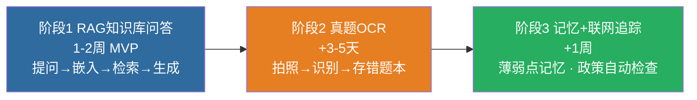

# 🤖 AI 学习助手 · 方案文档

> 灵感来自视频中的 AI 聊天网站（Chroma 向量库 + 百川嵌入 + RAG + 记忆 + 图像识别 + 联网搜索）。
> 目标：**把它变成你自己的备考工具 + 求职作品集**。
> 文档状态：**MVP 已完成（2026-08）** · 代码在 [`wpc725562-dotcom/ai-learning-assistant`](https://github.com/wpc725562-dotcom/ai-learning-assistant) · 分期推进。

---

## 一、为什么做（价值）

1. **备考刚需**：把 90+ 政治题、50+ 高数题、100+ 简答题、全部章节笔记做成可问答的知识库。
2. **求职作品集**：一个带 RAG + OCR 的 AI 应用，是日本信息安全/IT 岗求职的实打实项目（对应个人路线图「信息安全作品积累」）。
3. **学习实战**：Python + 向量数据库 + 嵌入模型 + API 集成，全是就业市场需要的技能。

---

## 二、技术栈（推荐：Python 为主）

| 层 | 选型 | 理由 |
|:---|:---|:---|
| 后端框架 | **FastAPI**（Python） | 轻量、异步、自带 API 文档；贴近安全/脚本方向 |
| 向量数据库 | **Chroma**（本地） | 视频同款；纯 Python、零运维、免费 |
| 嵌入模型 | **BGE-small / text2vec**（免费本地）或百川 API | 中文效果好；本地运行省钱 |
| LLM | DeepSeek API（你已有 key）或免费额度 | 成本可控 |
| OCR | **PaddleOCR**（免费本地中文 OCR） | 拍真题照片 → 转文字 |
| 记忆 | 自研（SQLite 存关键内容 + 时间权重） | 视频也是自研，简单可控 |
| 前端 | 简单 HTML/移动端适配（或复用 VitePress 页面） | 够用即可 |

> 💡 **为什么 Python 而不是 Node**：① 专升本你在学 C，Python 是「第二语言」但生态最全（OCR/嵌入/向量都是 Python 最强）；② 安全方向（你的目标岗位）脚本能力基本是 Python；③ 免费中文 OCR/嵌入模型 Python 集成最顺。

---

## 三、功能与分期



### 阶段 1：RAG 知识库问答（MVP，1-2 周）
```
用户提问 → 嵌入 → Chroma 检索相关笔记片段 → DeepSeek 生成回答
```
- 数据源：`高等数学/`、`政治理论/`、`历年真题/`、`资料/` 下的 markdown
- 输出：问答界面 + 「引用来源」（指出是哪篇笔记）
- **验收**：问「求导法则有哪些」能从高数笔记给出正确答案并带出处

### 阶段 2：真题 OCR（+3-5 天）
- 手机拍照 → PaddleOCR 识别 → 自动存成 markdown 进错题本
- 输出：识别文本 + 一键加入 `备考计划/错题本模板.md`

### 阶段 3：记忆系统 + 联网追踪（+1 周）
- 记忆：记住你错过的考点、薄弱章节，回答时结合上下文
- 联网：自动检查 JLPT/签证/考纲政策更新（配合 official-links 清单）

---

## 四、部署方案

| 方式 | 适用 | 成本 |
|:---|:---|:---|
| **本地运行** | 自己用 | 0 |
| **Cloud Studio（云端 IDE）** | 在线开发 + 测试 | 免费额度 |
| **服务器/VPS** | 正式上线给他人用 | 约 ¥30-100/月 |
| **GitHub Pages** | ❌ 只支持静态站，跑不了后端 | - |

> ⚠️ **重要认知**：GitHub Pages 只能托管静态页面（你现在的 VitePress 站）。**带后端的 AI 应用（FastAPI + Chroma）必须跑在能执行代码的环境**——本地、Cloud Studio、或服务器。所以「AI 学习助手」和「笔记网站」是两件事：网站静态展示，AI 助手是独立后端服务。

---

## 五、成本估算（尽量 0 元）

| 项 | 成本 |
|:---|:---|
| Chroma + PaddleOCR + BGE 嵌入 | 免费（本地） |
| DeepSeek API | 按量，日常问答每月几元内 |
| Cloud Studio / 本地 | 免费 |
| 服务器（可选） | ¥30-100/月（暂不需要） |

> 💡 **省钱核心**：嵌入用本地免费模型、LLM 用 DeepSeek 现有 key、向量库本地跑——前期 0 成本。

---

## 六、与现有仓库的关系

- **专升本笔记仓库**：提供数据（笔记/题库/真题）→ AI 助手的知识库
- **出国指南仓库**：提供「官方核对清单」→ 阶段 3 联网追踪的数据源
- **新项目建议独立成库**：`ai-learning-assistant`（代码和数据源分离，避免污染笔记库）

---

## 七、实施路线

- [x] **RAG 知识库**：Chroma + BGE 中文嵌入，615 块笔记已建索引，检索问答跑通
- [x] **真题 OCR**：easyocr 中英文识别，拍照转文字验证通过
- [ ] **FastAPI 后端 + Web 界面**（手机可用）
- [ ] 记忆系统（记住薄弱考点）
- [ ] 联网政策追踪（JLPT/签证/考纲）
- [ ] 完成后：作为作品集项目展示

> ✅ **已完成（2026-08）**：MVP 代码在 [`wpc725562-dotcom/ai-learning-assistant`](https://github.com/wpc725562-dotcom/ai-learning-assistant)，本地可直接运行。

---
[返回首页](/)
