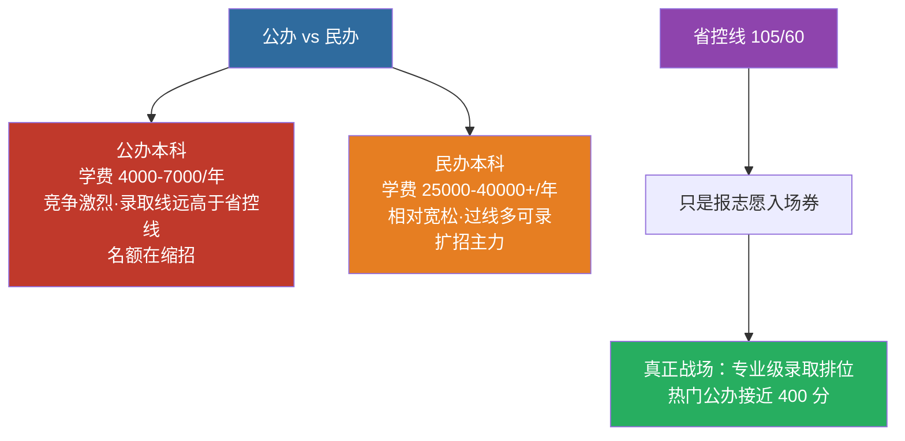

# 公办院校与录取（2025 官方名单 · 2027 届定位）

> 🎯 用途：你是 **2027 届考公办**，这是公办专插本和民办完全不同的**一档情报**。
> 📅 数据来源：广东省教育厅官方投档名单 + 高考直通车汇总（2025 年度）
> 🔗 对应 Obsidian 源：`历年真题/04-录取分数线与考情.md`

---

## 一、为什么公办完全不同于民办

| 维度 | 公办本科 | 民办本科 |
|:---|:---|:---|
| 学费 | 4000–7000 元/年 | 25000–40000+ 元/年 |
| 竞争强度 | **激烈**（实际录取线远高于省控线） | 相对宽松（过线多可录） |
| 名额趋势 | **缩招**（公立名额在压） | 扩招主力 |
| 录取逻辑 | 按排位从高到低，热门专业卷到接近 400 | 多为补齐志愿 |

> ⚠️ **核心认知**：你考公办，省控线（105/60 这类）只是**报志愿的入场券**，不代表能进。真正的战场是**专业级录取排位**。

> 📌 2025 年 4 所公办退出（广州航海/广东金融/东莞理工/五邑），佛山大学持续未招；招生从 7 万缩到 5.4 万——**公办缩得比民办狠**。

---

## 二、2025 公办招生院校（15 所）

| # | 公办院校 |
|:--|:---|
| 1 | 广东医科大学 |
| 2 | 韶关学院 |
| 3 | 惠州学院 |
| 4 | 韩山师范学院 |
| 5 | 岭南师范学院 |
| 6 | 肇庆学院 |
| 7 | 嘉应学院 |
| 8 | 广州美术学院 |
| 9 | 广东技术师范大学 |
| 10 | 广东财经大学 |
| 11 | 深圳职业技术大学 |
| 12 | 仲恺农业工程学院 |
| 13 | 广东石油化工学院 |
| 14 | 广东第二师范学院 |
| 15 | 深圳技术大学 |

> 2025 年新增 **深圳职业技术大学** 1 所公办。

---

## 三、重要变化（报考前必看）

1. **2025 年 4 所公办退出**（未在专业目录）：**广州航海学院、广东金融学院、东莞理工学院、五邑大学** —— 不一定永久退出，2026/2027 可能回归（往年有后期补录情况），需等当年最终目录。
2. **佛山大学**（佛大）持续未招（2024 至今）。
3. **缩招大背景**：招生名额从 **7 万多 → 约 5.4 万**，缩招近 2 万人。**公办缩得比民办狠**，录取竞争逐年抬升。

---

## 四、2027 届备考定位（考公办）

1. **不要盯省控线，盯目标校专业录取排位**：等你 2027 年 5 月报志愿前，把目标公办校**近 3 年该专业录取最低分/排位**列出来当基准（届时省考试院公布 2027 投档线后校准）。
2. **总分 500 双线**：政治100 + 英语100 + 专业基础课100 + 专业综合课200。公办热门往往要 **3 门主科卷到 90+**,四科总分冲 380–420+。
3. **专业基础课选型决定赛道**：
   - 走理工/经管 → **高等数学**（省控线 105/60，9 类最低挡,但高分考生扎堆）；
   - 走文科/管理 → 管理学 / 大学语文 / 民法等，省控线高 5–25 分。
   - **选专业基础课 = 选公办校的哪些专业你能报**，需结合你的目标专业定。
4. **公办热门专业可能一志愿挤满**：公办校部分专业只招公办批，未录满的才会到民办——所以**考公办必须第一梯队分数**。

---

## 五、录取数据说明（如实边界）

- **省控线**：见 [省控线-录取分数线](/guide/省控线-录取分数线)（2026 官方版 + 2025 官方版对照）。
- **各公办校专业级录取最低分/排位**：完整准确表需等省考试院发布 2027 投档线；历年细碎且过时风险高，本页不硬拼编造。**建议 2026 年 12 月（2027 大纲期）后** 依据省考试院官方「2027 投档线」更新到本节。
- 2025 完整招生专业汇总表（各校专业/学费/要求/考试科目）：见高考直通车原文（动态页,避免死链）。

---

> 相关：[省控线](/guide/省控线-录取分数线) · [时事备考](/posts/politics/notes/16-时事政治备考) · 真题总索引（源库文件，站点未发布版）