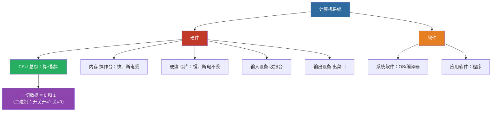

# 计算机基础理论

> 🎯 **一句话秒杀**：计算机 = 硬件 + 软件；一切数据在计算机里都是**0 和 1**（二进制）；写好的程序要经过**编译链接**才能运行。这是你学 C 语言的"全景地图"。

---

## ① 📊【历年真题考情】

**本章（计算机基础理论）在广东专升本计算机统考中的位置：**

| 项目 | 结论 |
|:---|:---|
| 定位 | **前置总览**——本身直接分值不高（约 3~8 分），但是理解后续所有章节的"地基" |
| 实考真题 | 2021 单选18（进制转换 630→二进制）、2023 填空（char 占1字节）、2026 单选8（编译/链接/运行错误）、2024 简答（数据项/ADT） |
| 考纲归属 | 2026 考纲「C语言基础」模块 + 新增考点10「程序运行环境与调试」 |
| 关联笔记 | 细节分别见 [1.1 C语言概述](1.1-C语言概述与基本概念.md)（编译过程）、[1.2 数据的存储与运算](1.2-数据的存储与运算.md)（进制/ASCII/补码）、[2.1 数据结构基本概念](2.1-数据结构基本概念.md)（数据项/ADT） |

**考场真实出现过的高频题：**
- 2021 单选18：十进制 630 的二进制是 → **1001110110**
- 2023 填空1：`char` 占 **1** 字节
- 2026 单选8：缺少分号属于**编译错误**；数组越界/除以 0 属于**运行错误**
- 2024 简答：数据项是数据结构中讨论的**最小单位**

> 🎯 **学习目标**：学完本章，你能 ① 手算任意十进制↔二进制的转换；② 说清位/字节/KB 的关系；③ 区分编译/链接/运行错误；④ 知道计算机由哪些部分组成——建立完整的学习地图。

---

## ② 🗣️【零基础大白话引入】

**计算机是什么？** 想象一间**中央厨房**：
- **CPU（中央处理器）** = 总厨，负责"算"和"指挥"
- **内存** = 灶台边的操作台，菜要放到手边才能炒（**速度快、断电就没了**）
- **硬盘（外存）** = 仓库，食材长期存放（**慢，但断电不丢**）
- **输入设备**（键盘鼠标）= 收银台，客人点单
- **输出设备**（显示器打印机）= 出菜口，把结果端给客人

**为什么全是 0 和 1？** 因为计算机最底层是**开关**——开=1，关=0。就像电灯的开关只有"开/关"两种状态，计算机用无数开关的组合表示一切：数字、文字、图片、声音。**进制转换**就是学会"用 0/1 表示我们熟悉的十进制数"。

**程序怎么跑起来？** 你写的 C 代码（`.c`）是给**人看**的，计算机只懂 0/1 机器码。中间需要"翻译官"：
- **编译**：把 .c 翻译成目标文件（.obj）——管"单页翻译"
- **链接**：把多个目标文件拼成可执行文件（.exe）——管"拼装成书"
- **运行**：真正执行



> 📌 本章是**第一张地图**：硬件五大件 + 二进制 + 编译链接运行——之后学 1.1/1.2 就有方向了。

> 💡 本章就是你的**第一张地图**：知道计算机由什么组成 → 知道数据怎么存（二进制）→ 知道程序怎么跑（编译链接）→ 知道数据结构是干嘛的。之后学 1.1、1.2 就有方向了。

---

## ③ 📖【正式核心知识点讲解】

> 本章为总览性质：只展开真题考过的细节（进制、编译运行、单位），其余概念点到即止并链接到对应系统笔记。

### 3.1 计算机系统组成（了解级）

```
计算机系统
├── 硬件系统
│   ├── 运算器 + 控制器（合称 CPU）
│   ├── 存储器（内存/外存）
│   ├── 输入设备（键盘/鼠标/扫描仪）
│   └── 输出设备（显示器/打印机）
└── 软件系统
    ├── 系统软件（操作系统、编译程序、数据库管理系统）
    └── 应用软件（Word、游戏、浏览器）
```

| 部件 | 作用 | 类比 |
|:---|:---|:---|
| CPU | 运算 + 控制 | 总厨 |
| 内存 | 临时存储正在运行的程序和数据 | 操作台 |
| 外存 | 永久存储（硬盘/优盘） | 仓库 |
| 输入设备 | 数据进计算机 | 收银台 |
| 输出设备 | 结果出计算机 | 出菜口 |

> 💡 **冯·诺依曼体系**：存储程序 + 程序控制（程序和数据都存内存，由 CPU 逐条执行）——现代计算机的基础，了解即可。

### 3.2 数据在计算机中的表示（重点）

#### 3.2.1 数制基础（2021 单选18 必考）

| 进制 | 基数 | 数码 | 后缀 |
|:---|:---:|:---|:---:|
| 二进制 | 2 | 0, 1 | B |
| 八进制 | 8 | 0~7 | O |
| 十进制 | 10 | 0~9 | D |
| 十六进制 | 16 | 0~9, A~F | H |

> **进位规则**：逢 N 进一（二进制逢 2 进 1，八进制逢 8 进 1...）

#### 3.2.2 十进制 → 二进制（除 2 取余法）

**方法**：不断除以 2，记录余数，**从下往上**读余数。

**例题：十进制 10 → 二进制**

| 步骤 | 除2 | 商 | 余数 |
|:---:|:---:|:---:|:---:|
| 1 | 10÷2 | 5 | **0**（最低位） |
| 2 | 5÷2 | 2 | **1** |
| 3 | 2÷2 | 1 | **0** |
| 4 | 1÷2 | 0 | **1**（最高位） |

> 余数从下往上读：`1010` → 十进制 10 = 二进制 **1010**
> 验证：`1×8 + 0×4 + 1×2 + 0×1 = 10` ✅

#### 3.2.3 二进制 → 十进制（按权展开法）

**方法**：每一位乘以 2 的"位置次方"，再求和。

**例题：二进制 1010 → 十进制**

| 位 | 1 | 0 | 1 | 0 |
|:---:|:---:|:---:|:---:|:---:|
| 权重 | 2³=8 | 2²=4 | 2¹=2 | 2⁰=1 |
| 值 | 1×8=8 | 0×4=0 | 1×2=2 | 0×1=0 |

> 求和：`8 + 0 + 2 + 0 = 10` → 二进制 1010 = 十进制 **10**

#### 3.2.4 数据存储单位（2023 填空关联）

| 单位 | 大小 | 说明 |
|:---|:---:|:---|
| 位（bit） | 最小单位 | 一个 0 或 1 |
| 字节（Byte） | 1 B = 8 bit | **基本单位**（char 占 1 字节） |
| KB | 1 KB = 1024 B | 千字节 |
| MB | 1 MB = 1024 KB | 兆字节 |
| GB | 1 GB = 1024 MB | 吉字节 |

> ✅ **2023 填空1**：`char` 占 **1** 字节（= 8 位）
> 💡 换算记住 **1024**（2 的 10 次方），不是 1000！

#### 3.2.5 原码与补码（负数存储）

> 负数的存储方式（详见 [1.2 数据的存储与运算](1.2-数据的存储与运算.md)）：
> **负数用补码存储** = 原码取反（反码）+ 1

| 数值 | 原码 | 反码 | 补码 |
|:---|:---:|:---:|:---:|
| +5 | 0000 0101 | 0000 0101 | 0000 0101 |
| -5 | 1000 0101 | 1111 1010 | 1111 1011 |

> 为什么用补码？让加减法共用一套电路。细节见 1.2。

#### 3.2.6 字符编码 ASCII

> 字符在计算机里也是数字——**ASCII 码**就是"字符↔数字"的对照表（详见 [1.2 数据的存储与运算](1.2-数据的存储与运算.md)）：

| 字符 | ASCII 码（十进制） |
|:---|:---:|
| `'0'` | 48 |
| `'A'` | 65 |
| `'a'` | 97 |

> 💡 规律：`'A'+32 = 'a'`；`'0'=48` 是数字字符起点。

### 3.3 程序从编写到运行（2026 考纲新增重点）

#### 3.3.1 编译链接过程（与 [1.1 C语言概述](1.1-C语言概述与基本概念.md) 呼应）

```
源代码 (.c) → 预处理 → 编译 → 汇编 → 链接 → 可执行文件 (.exe)
```

| 阶段 | 产物 | 干什么 |
|:---|:---|:---|
| 预处理 | `.i` | 处理 #include、#define |
| 编译 | `.s` → `.o/.obj` | C 代码 → 机器指令（单个文件） |
| 链接 | `.exe` | 多个 .obj + 库 → 可执行文件 |

#### 3.3.2 三种错误区分（2026 单选8 必考）

| 错误类型 | 什么时候发现 | 典型例子 |
|:---|:---|:---|
| **编译错误** | 编译阶段 | 缺少分号、括号不匹配、变量未声明 |
| **链接错误** | 链接阶段 | 函数/变量只有声明没有定义（符号找不到） |
| **运行错误** | 程序运行时 | 数组越界、除以 0、访问空指针 |

> ✅ **2026 单选8**：下列说法正确的是 → **B. 缺少分号通常属于编译错误**
> 记法：**语法找编译，符号找链接，越界/除零找运行**

### 3.4 数据结构基础概念（与 2.1 呼应）

| 概念 | 定义 | 例子 |
|:---|:---|:---|
| 数据项 | 数据结构中讨论的**最小单位**，不可再分割 | 学号、姓名、成绩 |
| 数据元素 | 数据的基本单位（可由多个数据项组成） | 一条学生记录 |
| 数据对象 | 性质相同的数据元素集合 | 全体学生 |
| ADT | 抽象数据类型 = 数学模型 + 操作集合 | 栈、队列 |

> ✅ **2024 简答**：数据项是数据结构中讨论的最小单位，不可再分割（例：学号、姓名、成绩）。
> 细节见 [2.1 数据结构基本概念](2.1-数据结构基本概念.md)。

---

## ④ 🧪【真题同源例题】

### 例题 1：入门基础题（先热热身）

把十进制 13 转换成二进制。

**逐项推演（除 2 取余）：**

| 步骤 | 除2 | 商 | 余数 |
|:---:|:---:|:---:|:---:|
| 1 | 13÷2 | 6 | **1**（最低位） |
| 2 | 6÷2 | 3 | **0** |
| 3 | 3÷2 | 1 | **1** |
| 4 | 1÷2 | 0 | **1**（最高位） |

> 余数从下往上读：`1101`
> 验证：`1×8+1×4+0×2+1×1 = 13` ✅
> 答案：十进制 13 = 二进制 **1101**

### 例题 2：2021 真题改编（进制转换）

十进制 630 的二进制是（　　）

A. 1001110000　　B. 1001110110　　C. 1010110100　　D. 1010100111

**逐项推演（除 2 取余法）：**

| 步骤 | 除2 | 商 | 余数 |
|:---:|:---:|:---:|:---:|
| 1 | 630÷2 | 315 | **0** |
| 2 | 315÷2 | 157 | **1** |
| 3 | 157÷2 | 78 | **1** |
| 4 | 78÷2 | 39 | **0** |
| 5 | 39÷2 | 19 | **1** |
| 6 | 19÷2 | 9 | **1** |
| 7 | 9÷2 | 4 | **1** |
| 8 | 4÷2 | 2 | **0** |
| 9 | 2÷2 | 1 | **0** |
| 10 | 1÷2 | 0 | **1**（最高位） |

> 余数从下往上读：`1001110110`
> 验证：512+64+32+16+4+2 = 630 ✅（按权展开核对）
> ✅ 答案：**B. 1001110110**（2021 单选18 原题）
> 陷阱：A（1001110000）少了最后一位，D（1010100111）顺序错。

### 例题 3：数据单位换算

4 MB 等于多少字节？

**逐项推演：**
1. 1 KB = 1024 B
2. 1 MB = 1024 KB = 1024 × 1024 B = 1048576 B
3. 4 MB = 4 × 1048576 = **4194304 B**

> 记忆：每级乘 1024，KB→B 乘一次 1024，MB→B 乘两次 1024。

### 例题 4：2026 真题改编（编译/链接/运行）

下列说法正确的是（　　）

A. 数组越界一定能在编译阶段发现
B. 缺少分号通常属于编译错误
C. 除以 0 一定属于链接错误
D. 函数声明不匹配一定不会报警

**逐项分析：**
1. A：数组越界 → 运行时才发现 ❌
2. B：缺分号 → 语法错 → **编译阶段** ✅
3. C：除以 0 → **运行错误**（不是链接）❌
4. D：函数声明不匹配 → 编译器通常报警 ❌

> ✅ 答案：**B**（2026 单选8 原题）。口诀：语法找编译，符号找链接，越界除零找运行。

---

## ⑤ ⚠️【历年真题高频扣分坑】

| # | 陷阱 | 错误做法 | 正确做法 | 出处 |
|:---:|:---|:---|:---|:---|
| 1 | **进制余数顺序** | 从上往下读余数 | 除 2 取余要**从下往上**读 | 2021 单选18 |
| 2 | **进制转换验证** | 转完不检查 | 按权展开验证（512+64+...=630） | 2021 单选18 |
| 3 | **字节单位用 1000** | 1KB=1000B | **1KB=1024B**（2 的 10 次方） | 经典 |
| 4 | **char 字节数** | 以为 char 占 2 字节 | char 占 **1** 字节（8 位） | 2023 填空1 |
| 5 | **编译/运行混淆** | 数组越界当编译错误 | 越界/除0是运行错误 | 2026 单选8 |
| 6 | **bit vs Byte** | 1 字节=1 位 | 1 字节 = **8 位** | 经典 |
| 7 | **ASCII 数字字符** | 以为 '0' 是 0 | '0' 的 ASCII = **48** | 1.2 关联 |
| 8 | **补码步骤乱** | 取反不加 1 | 补码 = 反码 **+1** | 经典 |
| 9 | **冯诺依曼** | 以为数据存硬盘 | 存储程序：**程序和数据都在内存** | 了解 |
| 10 | **编译单页/链接拼装** | 混两个阶段 | 编译管单文件，链接管拼接 | 2026 考纲 |

> 📌 **最值钱的一条**：第 1、2 条（进制余数顺序 + 按权验证）是 2021 单选18 的得分关键——**"从下往上读"和"转完验证"** 双保险，进制题必拿分。

---

## ⑥ 📝【课后自测练习题】

**1.** 十进制 25 的二进制是（　　）（2021 真题风格）

A. 11001　　B. 10101　　C. 11010　　D. 11101

________________________________________________

**2.** 3 KB 等于（　　）字节（2023 真题风格）

A. 3000　　B. 3072　　C. 2048　　D. 1536

________________________________________________

**3.** 下列关于程序错误的说法，正确的是（　　）（2026 真题风格）

A. 数组越界属于编译错误
B. 除以 0 属于链接错误
C. 缺少分号属于编译错误
D. 函数声明不匹配一定不会报警

________________________________________________

**4.** 判断：`char` 类型变量在内存中占 1 个字节。（　　）（2023 真题风格）

A. 正确　　B. 错误

________________________________________________

<details>
<summary>👆 点击展开参考答案与解析</summary>

**第1题**：**A. 11001**
- 25÷2=12 余 1；12÷2=6 余 0；6÷2=3 余 0；3÷2=1 余 1；1÷2=0 余 1
- 从下往上：11001；验证 16+8+1=25 ✅

**第2题**：**B. 3072**
- 3 KB = 3 × 1024 = 3072 字节（1KB=1024B）

**第3题**：**C. 缺少分号属于编译错误**
- 缺分号破坏语法 → 编译阶段（2026 单选8 口径）
- A 越界是运行错误；B 除 0 是运行错误；D 声明不匹配编译器会报警

**第4题**：**A. 正确**
- char 占 1 字节 = 8 位（2023 填空1 关联）

</details>

---

## 📖 关联笔记导航

> 本章是总览，细节请看对应系统笔记：

| 内容 | 关联笔记 |
|:---|:---|
| 编译/链接/运行错误细节 | [1.1 C语言概述与基本概念](1.1-C语言概述与基本概念.md) |
| 进制/ASCII/原码补码/数据类型 | [1.2 数据的存储与运算](1.2-数据的存储与运算.md) |
| 程序运行环境与调试 | [1.11 程序运行环境与调试](1.11-程序运行环境与调试.md) |
| 数据项/ADT/数据结构概念 | [2.1 数据结构基本概念](2.1-数据结构基本概念.md) |
| 返回计算机笔记索引 | [index](index.md) |

## 📺 配套视频

> 零基础第一课，先看视频建立概念。

- [升本啦 P1 计算机基础知识](https://m.bilibili.com/video/BV1KU4y167ds?p=1)
- [强哥 P1~P3 C语言与计算机基础](https://m.bilibili.com/video/BV1Ye411Y7Ue?p=1)
