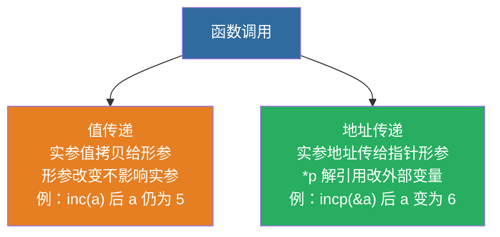

# 函数

> 🎯 **一句话秒杀**：函数是C程序的基本组成单位——把重复代码打包成可复用的模块，**高内聚低耦合**；本章的重头戏是**递归**（五星必考，约15分）。

---

## ① 📊【历年真题考情】

**本章（函数）在广东专升本计算机统考中的位置：**

| 项目 | 结论 |
|:---|:---|
| 出题频次 | **⭐⭐⭐⭐⭐（五星必考）**——2026 考纲全解明确标注"函数：单选、简答、编程，约15分"；"函数的定义与调用 4/4 年"（年年必考） |
| 常考题型 | 单选（2021、2022）、判断（2023、2024）、填空（2024 指针形参）、计算/程序阅读（2023 递归）、简答（2023 递归优缺点）、编程大题（2024/2026） |
| 预估分值 | **15~25 分 / 200 分**（约 8%~13%，全科目最高分值模块之一） |
| 考纲归属 | 2026 考纲「模块化」考点6（函数定义、调用、参数传递、作用域、递归） |

**考场真实出现过的高频题：**
- 2021 单选：`return` 一次只能返回一个值
- 2022 单选10：数组名作函数参数传递的是首地址
- 2023 计算：递归 `sub(6)` = **21**，且调用后 **i 仍为 6**（值传递+递归融合）
- 2023 判断6：C 可嵌套调用（对）；简答4：递归优缺点
- 2024 判断3：`{}` 复合语句内变量作用域限于内部；判断4：不同函数同名变量互不影响
- 2024 填空1：指针形参补全 `*z = x + y`
- 2024 判断：函数是 C 程序基本组成单位

> 🎯 **学习目标**：学完本章，你能 ① 说清形参/实参、值传递/地址传递的区别；② 手推任何递归函数的结果（含调用栈逐层展开）；③ 判断作用域与同名变量；④ 补全指针形参函数——这四类题就是本章真题的全部考法。

---

## ② 🗣️【零基础大白话引入】

**函数是什么？** 想象你是餐厅老板，后厨有专门负责切菜的、炒菜的、装盘的——每个岗位都是一段**固定流程**，客人点菜时直接喊一声"炒菜师傅，来份番茄炒蛋！"就行，不用把流程重新讲一遍。**函数就是这种"定制的子任务"**：写一次，随时调用，还能传不同原料（参数）进去。

**为什么用函数？**
1. **代码复用**：同样的计算写一次，到处调用（如 `add(3,5)`、`add(10,20)`）
2. **模块化**：程序拆成小模块，好读好改（高内聚低耦合）
3. **递归的基础**：函数能调用自己，就能解决"套娃"问题

**递归是什么？** 递归就像**套娃**——最大的娃娃里面套一个稍小的，再套一个更小的……直到最小的那个（**递归出口**）停下来，然后一层层"倒着打开"回来。或者像**传话游戏**：你问第一个人"第6个人的年龄"，他问第二个人……传到第6个人（出口），再一层层传回来。

> 💡 本章主线：**定义/调用（怎么用）→ 形实参/传参（数据怎么进）→ 递归（自己调自己，重点！）**。函数是编程题的地基，递归是计算题的送分题。

---

## ③ 📖【正式核心知识点讲解】

> 本章知识点 = 考纲要求 + 历年真题实际考过的内容。真题未考、考纲不作要求的超纲内容已剔除或标注"了解"。

### 3.1 函数的定义与调用

#### 函数定义格式

```c
返回值类型 函数名(形参列表) {
    函数体;
    return 返回值;
}
```

```c
// 定义一个加法函数
int add(int a, int b) {
    return a + b;
}
```

#### 函数调用

```c
int sum = add(3, 5);  // 3和5是实参
printf("%d", sum);    // 8
```

> 💡 **函数调用三步**：① 实参值传给形参 → ② 执行函数体 → ③ return 返回结果给调用处。

### 3.2 形参 vs 实参（高频考点）

```c
int add(int a, int b) {  // a,b 是形参
    return a + b;
}

int main() {
    int x = 3, y = 5;
    int sum = add(x, y);  // x,y 是实参
    return 0;
}
```

| 区别 | 形参 | 实参 |
|:---|:---|:---|
| 定义位置 | 函数定义时 | 函数调用时 |
| 有无值 | **定义时没有值** | 有确定的值 |
| 存储 | 调用时才分配内存 | 已有存储空间 |
| 关系 | 形参是实参的**拷贝** | 实参→形参单向传值 |

#### 🚨 红牌警告
> **实参到形参是单向值传递！** 形参改变不影响实参
> ```c
> void swap(int x, int y) {    // ❌ 交换不了！
>     int temp = x;
>     x = y;
>     y = temp;
> }
> // 调用 swap(a,b) —— a和b不变！
> ```

**想交换怎么办？** 用指针（见1.8节），这就是"地址传递"。

#### 3.2.1 值传递 vs 地址传递 并排对比（真题必考）

| | 值传递 | 地址传递（指针） |
|:---|:---|:---|
| 形参类型 | 基本类型（int、char...） | 指针类型（int*、char*...） |
| 传什么 | 实参的**值拷贝** | 实参的**地址** |
| 函数内改形参 | **不影响实参** | **影响实参指向的变量** |
| 用途 | 计算返回值 | 修改外部变量 / 返回多个值 |
| 典型 | `void swap(int x, int y)` | `void swap(int *x, int *y)` |

```c
// 值传递：改不了外面
void inc(int x) { x++; }
// 地址传递：改得了外面
void incp(int *p) { (*p)++; }

int main() {
    int a = 5;
    inc(a);     // 传值 → a 还是 5
    incp(&a);   // 传地址 → a 变成 6
    return 0;
}
```

> ✅ **2024 填空1**（指针形参）：`void add(int x, int y, int *z) { ____; }` 补全 → 填 **`*z = x + y`**（z 是 `int*`，必须解引用 `*z` 才能改外部变量）



> 📌 记忆：**值传递单向拷贝改不了外面；地址传递解引用能改外面**——2024 填空 1 必须写 `*z = x + y`。

### 3.3 函数的返回值

```c
int func() { return 100; }      // 返回整数
double func() { return 3.14; }  // 返回浮点数
void func() { ... }             // 无返回值（不需要return）
void func() { return; }         // 可以提前结束
```

#### 🚨 红牌警告
> **函数类型和return类型不一致时——以函数类型为准！**
> ```c
> int func() {
>     return 3.14;  // 返回 3（被截断为int）
> }
> ```

#### 3.3.1 return 的规则（2021 单选 必考）

| 说法 | 对错 | 说明 |
|:---|:---:|:---|
| 被调函数可以不用 `return` | ✅ 对 | void 函数或执行完自然结束 |
| 被调函数可出现多个 `return` | ✅ 对 | 提前分支返回 |
| 有返回值就一定要有 `return` | ✅ 对 | 否则返回值不确定 |
| **一个 `return` 可返回多个值** | ❌ **错** | **一次 return 只能返回一个值**（要多个用指针/结构体） |

> ✅ **2021 单选**：错误的说法是 → **D. 一个 `return` 可返回多个值给调用函数**
> 需要"返回多个值"时：用**指针形参**（2024 填空1 的 `*z = x + y`）或结构体。

### 3.4 函数的声明

#### 为什么要声明？
C语言是**从上到下编译**的——如果函数定义在调用之后，需要先声明

```c
#include <stdio.h>

int add(int a, int b);       // 函数声明（告诉编译器有这个东西）

int main() {
    printf("%d", add(3,5));  // ✅ 虽然add定义在后面，但已声明
    return 0;
}

int add(int a, int b) {      // 函数定义
    return a + b;
}
```

#### 声明时的形参名可以省略

```c
int add(int, int);  // ✅ 合法的函数声明（只写类型就行）
```

### 3.5 函数间的参数传递

#### 3.5.1 数组作为参数（2022 单选10 必考）

```c
// 一维数组传参
void print_arr(int arr[], int n) {          // 或 int *arr
    for (int i = 0; i < n; i++)
        printf("%d ", arr[i]);
}

// 二维数组传参
void print_matrix(int arr[][4], int rows) {  // 列数不能省略！
    for (int i = 0; i < rows; i++) {
        for (int j = 0; j < 4; j++)
            printf("%d ", arr[i][j]);
        printf("\n");
    }
}
```

#### 🔑 秒杀秘籍
> **数组名作为函数参数时，传递的是地址（首元素地址）**
> 所以函数内**可以修改原数组的内容**
> 同时要注意：**数组作为参数时，sizeof(arr) 在函数内是4（指针大小）**，不是数组大小！

> ✅ **2022 单选10**：数组名作为函数参数传递的是 → **B. 首地址**（不是长度、元素值、个数）

### 3.6 嵌套调用（2023 判断6）

```c
int max(int a, int b) { return a > b ? a : b; }

int max3(int a, int b, int c) {
    return max(max(a, b), c);  // 嵌套调用：先比较a和b，再和c比
}
```

```
执行顺序：
main() → max3(3,7,5) → max(3,7) → 返回7 → max(7,5) → 返回7 → main()
```

#### 不允许嵌套定义
C语言中**不能**在一个函数内部定义另一个函数
```c
void func1() {
    void func2() { ... }  // ❌ 语法错误！C不支持
}
```

> ✅ **2023 判断6**：C 语言可以嵌套**调用**（对）——注意区分：调用可嵌套，**定义**不可嵌套。

### 3.7 作用域（2024 判断3/4 必考）

> **作用域 = 变量"活"的范围**

| 规则 | 例子 |
|:---|:---|
| 复合语句 `{}` 内定义的变量，作用域限于该块内 | `{ int x; }` 离开 `}` 后 x 不可访问 |
| 不同函数中可以使用同名变量，互不影响 | main 里 `a` 和 func 里 `a` 各自独立 |
| 局部变量在各自**栈帧**中 | 每次函数调用都有独立内存 |

> ✅ **2024 判断3**："复合语句（`{}`）中定义的变量，其作用域仅限于该复合语句内部" → **对**
> ✅ **2024 判断4**："不同函数中可以使用同名的变量，它们互不影响" → **对**

```c
int main() {
    int a = 1;
    { int a = 2;          // 块内另定义 a，遮蔽外层
      printf("%d", a); }  // 输出 2
    printf("%d", a);      // 输出 1（外层 a 不受影响）
    return 0;
}
```

### 3.8 递归（五星必考 · 本章核心）

#### 递归的两个要素
1. **递归出口**（终止条件）
2. **递归表达式**（问题规模缩小）

```c
// 求n的阶乘（经典递归）
int fact(int n) {
    if (n <= 1) return 1;       // 递归出口
    return n * fact(n - 1);     // 递归表达式
}
```

```
fact(4) = 4 * fact(3)
        = 4 * 3 * fact(2)
        = 4 * 3 * 2 * fact(1)
        = 4 * 3 * 2 * 1
        = 24
```

#### 3.8.1 递归调用栈"递→归"逐层推演（2023 计算题必考）

**例题：递归求和** `sub(n)` 返回 `1+2+...+n`：

```c
int sub(int n) {
    if (n == 1) return 1;          // 出口
    return n + sub(n - 1);         // 递推
}
```

**求 sub(3) 的完整过程（调用栈展开）：**

| 步骤 | 状态 | 说明 |
|:---:|:---|:---|
| ① 递 | `sub(3)` 被调用 | 3≠1，要算 `3 + sub(2)`，先挂起 |
| ② 递 | `sub(2)` 被调用 | 2≠1，要算 `2 + sub(1)`，先挂起 |
| ③ 递 | `sub(1)` 被调用 | 1==1，**触底返回 1**（出口） |
| ④ 归 | `sub(2) = 2 + 1 = 3` | sub(1) 返回后，sub(2) 继续 |
| ⑤ 归 | `sub(3) = 3 + 3 = 6` | sub(2) 返回后，sub(3) 继续 |
| 结果 | **6** | 即 1+2+3 |

> ✅ **2023 真题**：`sub(6)` = `6+5+4+3+2+1` = **21**，且调用后 **i 仍为 6**（值传递——递归传的是值拷贝，原变量不变）

#### 3.8.2 常见递归题

```c
// 斐波那契数列：1,1,2,3,5,8,13...
int fib(int n) {
    if (n <= 2) return 1;              // 前两项为1
    return fib(n-1) + fib(n-2);        // 第三项开始是前两项之和
}
```

**fib(4) 调用树展开：**
```
        fib(4)
       /      \
   fib(3)    fib(2)
   /    \       |
fib(2) fib(1)   1
  |      |
  1      1
= 1 + 1 + 1 = 3
```

> 手动推递归的**三步法**：① 找到出口（n 最小的情况）→ ② 从出口倒推 → ③ 逐层带回。

#### 🚨 红牌警告
> **递归缺陷（2023 简答4 口径）：** ① 简洁易读，但② 调用栈开销大、容易栈溢出；③ 斐波那契用递归算大数会**指数爆炸**——重复计算太多；④ 大数据量时用**迭代**替代递归

> ✅ **2023 简答4 标准答案**：递归的优点——程序简洁、逻辑清晰；缺点——效率低（重复计算）、栈开销大（层数深易溢出）。需根据数据规模选择递归或迭代。

---

## ④ 🧪【真题同源例题】

### 例题 1：入门基础题（先热热身）

```c
#include <stdio.h>
void fun(int x) { x = 100; }
int main() {
    int a = 5;
    fun(a);
    printf("%d", a);
    return 0;
}
```

**逐变量推演：**
1. `fun(a)`：把 a 的值 **5** 拷贝给形参 x
2. 函数内 `x = 100`：**只改了形参 x 的拷贝**，x 变成 100
3. 函数结束，x 销毁；a 还是 **5**
4. 输出：`5`

> ✅ 这是值传递最经典的考法（旧笔记闭卷题2 同款），答案 5。

### 例题 2：2023 真题改编（递归求和 + 值传递）

```c
#include <stdio.h>
int sub(int n) {
    if (n == 1) return 1;
    return n + sub(n - 1);
}
int main() {
    int i = 6;
    printf("%d", sub(i));
    printf(" %d", i);
    return 0;
}
```

**逐层推演：**
1. `sub(6)` 递推展开：`6 + sub(5)` → `5 + sub(4)` → ... → `2 + sub(1)`
2. `sub(1)` 触底返回 **1**（出口）
3. 逐层回归：`sub(2)=2+1=3`，`sub(3)=3+3=6`，`sub(4)=4+6=10`，`sub(5)=5+10=15`，`sub(6)=6+15=**21**`
4. `i` 是实参，传的是值拷贝 → i 仍是 **6**
5. 输出：`21 6`

> ✅ 对应 2023 真题 `sub(6)=21，i 仍为 6`。**双考点融合**：递归求和 + 值传递不影响原变量。

### 例题 3：2024 真题改编（指针形参 · 填空补全）

下面程序通过指针形参返回两个数的和，请补全空缺：

```c
void add(int x, int y, int *z) {
    ________;
}
```

**逐项推演：**
1. 形参 `z` 是 `int*`（指针），指向调用者的某个变量
2. 要把 x+y 的结果**存到 z 指向的变量** → 必须**解引用** `*z`
3. 赋值：`*z = x + y;`
4. 答案：**`*z = x + y`**

> ✅ 对应 2024 填空1。**关键**：指针形参改外部变量必须 `*z`（解引用），直接写 `z = x + y` 是错的（只改了指针本身）。

### 例题 4：2024 真题改编（作用域 · 判断）

判断：`{}` 复合语句中定义的变量，函数外能否访问？

**逐项推演：**
1. 变量在 `{}` 内定义 → 作用域只在本块
2. 离开 `}` → 变量销毁，不可访问
3. 结论：**不能访问** → 该说法正确（√）

```c
int main() {
    int a = 1;
    { int b = 2; }   // b 只在 {} 内有效
    // printf("%d", b);  // ❌ 编译错误：b 未定义
    return 0;
}
```

> ✅ 对应 2024 判断3（答案 √）。同源考点：不同函数同名变量互不影响（2024 判断4，√）。

---

## ⑤ ⚠️【历年真题高频扣分坑】

| # | 陷阱 | 错误做法 | 正确做法 | 出处 |
|:---:|:---|:---|:---|:---|
| 1 | **值传递想改外部** | 写 `swap(a,b)` 以为交换了 | 形参是拷贝，**改不了**；要改用指针 | 2024 |
| 2 | **return 返回多值** | 以为一个 return 能返回多个值 | 一次 return **只能返回一个值** | 2021 单选 |
| 3 | **指针形参忘解引用** | 填空填 `z = x + y` | 必须 `*z = x + y`（解引用） | 2024 填空1 |
| 4 | **数组名当值传递** | 以为数组作参数是拷贝 | 数组名作参数**传地址**，能改原数组 | 2022 单选10 |
| 5 | **作用域混淆** | 以为 `{}` 内变量块外可用 | 离开 `}` 即失效 | 2024 判断3 |
| 6 | **同名变量冲突** | 以为不同函数同名会冲突 | 各自栈帧，互不影响 | 2024 判断4 |
| 7 | **递归忘出口** | 递归不写终止条件 | 必须有递归出口，否则死循环/栈溢出 | 2023 简答 |
| 8 | **递归后原变量变化** | 以为 sub 调用后 i 变了 | 值传递，i 仍为原值 | 2023 计算 |
| 9 | **嵌套定义误解** | 以为 C 支持函数内定义函数 | C **不允许**嵌套定义，只允许嵌套调用 | 2023 判断6 |
| 10 | **函数内 sizeof 数组** | 函数内 `sizeof(arr)` 当数组大小 | 形参是指针，sizeof=4（指针大小） | 经典 |

> 📌 **最值钱的一条**：第 2 条（return 只能返回一个值）是 2021 单选原题；而"返回多个值"的正解就是第 3 条的**指针形参**（2024 填空1）——两条真题正好连成"值传递/地址传递"的核心考点链。

---

## ⑥ 📝【课后自测练习题】

**1.** 写出下列程序的输出结果（2024 真题风格）：

```c
#include <stdio.h>
void fun(int x) { x = 100; }
int main() {
    int a = 5;
    fun(a);
    printf("%d", a);
    return 0;
}
```

________________________________________________

**2.** 下列程序段执行后，输出结果是（　　）（2023 真题风格）

```c
int sub(int n) {
    if (n == 1) return 1;
    return n + sub(n - 1);
}
// 主函数调用 printf("%d", sub(4));
```

A. 6　　B. 10　　C. 8　　D. 24

________________________________________________

**3.** 下面程序的功能是通过指针形参返回两个数的和，请补全（　　）（2024 真题风格）

```c
void add(int x, int y, int *z) {
    ________;
}
```

A. `z = x + y`　　B. `*z = x + y`　　C. `z = &x + &y`　　D. `*z = &x + y`

________________________________________________

**4.** 判断：不同函数中可以使用同名的变量，它们互不影响。（　　）（2024 真题风格）

A. 正确　　B. 错误

________________________________________________

<details>
<summary>👆 点击展开参考答案与解析</summary>

**第1题**：输出 **5**
- 值传递：`fun(a)` 传的是 a 的值拷贝 5，函数内改的是形参 x，a 不变

**第2题**：**B. 10**
- `sub(4) = 4 + sub(3) = 4 + 3 + sub(2) = 4 + 3 + 2 + sub(1) = 4+3+2+1 = 10`
- 陷阱：D（24）是 4!，混淆了阶乘和求和

**第3题**：**B. `*z = x + y`**
- z 是指针，改它指向的变量必须解引用 `*z`
- A 只改了指针本身（错误）；C/D 语法/逻辑错误

**第4题**：**A. 正确**
- 各函数局部变量在各自栈帧，同名互不影响（2024 判断4 原题）

</details>

---

## 📝 原有闭卷真题挑战（保留原内容）

**（点击下方空白查看答案）**

```
1. 函数调用时，形参改变会影响实参吗？

2. 写出输出：
   void fun(int x) { x = 100; }
   int main() { int a=5; fun(a); printf("%d", a); }

3. 函数声明一定要写形参名吗？

4. fact(5) 的返回值？

5. 递归必须有的两个要素是？
```

<details>
<summary>👆 点击展开答案</summary>

1. **不会**——实参到形参是**单向值传递**，形参是实参的拷贝
2. **5**（值传递，fun里改的是x的拷贝）
3. **不需要**——`int add(int, int);` 合法，只声明类型就行
4. **120**（5! = 5×4×3×2×1）
5. **递归出口（终止条件）** + **递归表达式（规模缩小）**

</details>

---

## 📖 教材习题对照

| 教材习题 | 知识点 | 难度 |
|:---|:---|:---:|
| 习题7.1~7.3 | 函数定义与调用 | ⭐⭐ |
| 习题7.4 | 形参与实参 | ⭐⭐ |
| 习题7.7~7.8 | 数组做函数参数 | ⭐⭐⭐ |
| 习题7.10~7.12 | 递归函数 | ⭐⭐⭐⭐ |
| 习题7.14 | 汉诺塔问题 | ⭐⭐⭐⭐⭐ |

> 对应教材：谭浩强《C程序设计》第5版 → **第7章 用函数实现模块化程序设计**
> 对应考试大纲：**考点7 — 函数**

## 📺 配套视频

> 复习到本考点 → 先看视频补讲，再刷上面「闭卷挑战」。

- [升本啦 P20~24 函数/参数/作用域](https://m.bilibili.com/video/BV1KU4y167ds?p=20)
- [翁恺 P68~74 函数定义/参数传递/本地变量](https://m.bilibili.com/video/BV1dr4y1n7vA?p=68) · 浙大翁恺 1894万
