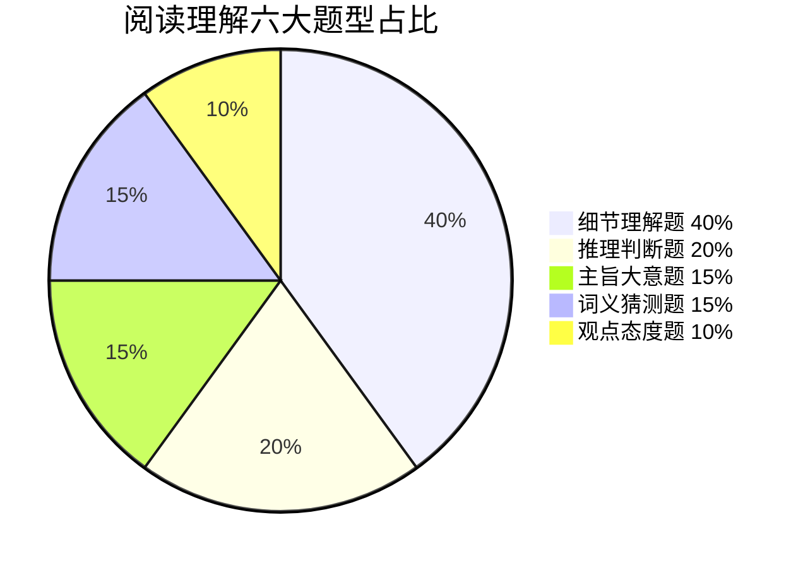
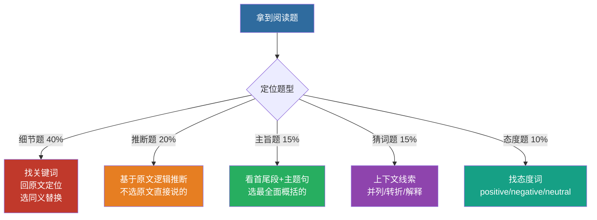

# 📖 阅读理解高分技巧

> 专升本英语阅读 | 六大题型 | 解题套路

---

## 一、题型统计

| 题型 | 占比 | 难度 |
|:---|:---:|:---:|
| 🔍 细节理解题 | ~40% | ⭐ 易 |
| 🎯 推理判断题 | ~20% | ⭐⭐⭐ 难 |
| 📌 主旨大意题 | ~15% | ⭐⭐ 中 |
| 🔤 词义猜测题 | ~15% | ⭐⭐ 中 |
| 💭 观点态度题 | ~10% | ⭐⭐ 中 |



> 📌 细节题占 40%——**回原文定位 + 同义替换**是最核心的"一招鲜"。

---

## 二、六大题型破解

### 1️⃣ 细节理解题（40%）

**常见问法：**
- According to the passage, ...
- What is mentioned about ...?
- Which of the following is TRUE/NOT true?

**解题步骤：**
1. 题干中找关键词（专有名词、数字、大写词）
2. 用关键词**回原文定位**
3. 对比选项和原文，选同义替换的项

> ⚠️ **干扰项特征：** 张冠李戴、偷换概念、过度推断、与原文相反

### 2️⃣ 推理判断题（20%）

**常见问法：**
- It can be inferred from the passage that...
- The author implies/suggests that...
- What can we learn from the passage?

**解题要点：**
- ✅ 基于原文逻辑合理推断
- ❌ 不要过度发挥（原文没说的不能选）
- ❌ 不要选原文**直接陈述**的内容

> **口诀：** 推断题选"可能但不肯定"的，不选"原文直接说的"



### 3️⃣ 主旨大意题（15%）

**常见问法：**
- What is the main idea of the passage?
- The best title for the passage would be...
- What is the passage mainly about?

**解题步骤：**
1. 读**首段首尾句 + 每段首句**
2. 找**主题句**（通常在开头或结尾）
3. 排除以偏概全、过于宽泛的选项

### 4️⃣ 词义猜测题（15%）

**常见问法：**
- The word "..." in paragraph X probably means...
- Which of the following can replace "..."?

**猜词技巧：**

| 线索类型 | 标志词 | 示例 |
|:---|:---|:---|
| 定义法 | is, means, refers to | A **habitat** is the natural home of an animal. |
| 对比法 | but, however, while, unlike | Unlike his **generous** brother, he is very stingy. |
| 因果法 | because, so, since, thus | He was so **exhausted** that he fell asleep immediately. |
| 举例法 | such as, for example, like | **Carnivores**, such as lions and tigers, eat meat. |
| 同义法 | or, that is, i. e. | The **adversary**, or opponent, was strong. |

### 5️⃣ 观点态度题（10%）

**常见问法：**
- What is the author's attitude towards...?
- The tone of the passage is...

**态度词库：**

| 正向 | 负向 | 中立 |
|:---|:---|:---|
| positive | negative | neutral |
| supportive | critical | objective |
| optimistic | pessimistic | impartial |
| favorable | disapproving | indifferent |

> 🚨 **小炸弹：** indifferent（漠不关心的）几乎永远不选——作者写一篇文章不可能漠不关心

---

## 三、长难句分析

### 三步拆解

```
Step 1: 找谓语动词 → 确定有几个句子
Step 2: 找连词/关系词 → 分清主从句
Step 3: 去修饰留主干 → 主谓宾即核心
```

### 实战演练

> **原句：** The study, *which was conducted by researchers from Harvard University*, found that students who **regularly participated in physical exercise** performed better on exams.

- **主干：** The study found that students performed better on exams.
- **修饰1：** which was conducted by...（定语从句，修饰study）
- **修饰2：** who regularly participated...（定语从句，修饰students）

---

## 四、时间分配策略

```
文章阅读量：4篇 × 300-400词 = 1200-1600词
总用时：40分钟

┌─────────────────────────────┐
│ 通读全文划关键 → 5min/篇      │
│ 逐题定位找依据 → 4min/篇      │
│ 填涂检查 → 1min/篇           │
│                              │
│ 每篇总计：10分钟              │
│ 四篇总计：40分钟              │
└─────────────────────────────┘
```

---

## 五、高频干扰项特征

| 干扰类型 | 特征 | 识别方法 |
|:---|:---|:---|
| 偷换概念 | 用原文某词造个不同意思的句子 | 逐字比对 |
| 张冠李戴 | A的事说成B的 | 注意主语对应 |
| 过度推断 | 推到了原文没说的一步 | 回到原文看能否推出 |
| 以偏概全 | 局部当整体 | 看选项范围是否太大 |
| 正反混淆 | 与原文意思相反 | 注意否定词 |

---

## 秒杀口诀

> **细节定位找替换，推断两选选弱的那一个**
> **主旨看首段，猜词看上下文**
> **态度题excited/surprised别乱选，客观中立最安全**
> **长难句三步走：找谓、分清、留主干**

[VOICE: 阅读理解占30分是试卷的大头，关键是学会定位和排除干扰项，细节题考最多，靠关键词回原文定位找同义替换就行！]
