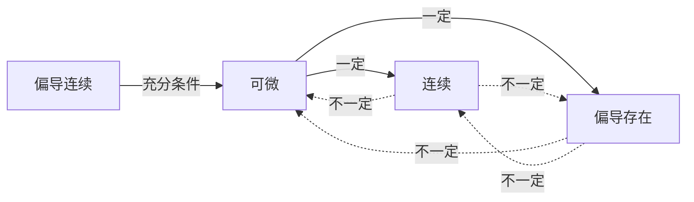

[ROUTE]: 高等数学/第五章 多元函数/5.2 偏导数与全微分.md

# 5.2 偏导数与全微分

> **学科系统**：高等数学 → 多元函数 → 偏导数与全微分
> **秒杀类比**：偏导数就是"固定其他变量只看一个"的导数——就像在三维曲面上沿 $x$ 方向切一刀看截面斜率。全微分则是"所有方向微小变化的线性组合"——像天气预报中，温度变化 = 经度影响 + 纬度影响 + 高度影响。

## 一、 核心知识解构

### 1. 偏导数的定义

函数 $z = f(x,y)$ 在 $(x_0,y_0)$ 处对 $x$ 的偏导数：

$$f_x(x_0,y_0) = \frac{\partial z}{\partial x}\bigg|_{(x_0,y_0)} = \lim_{\Delta x \to 0} \frac{f(x_0 + \Delta x, y_0) - f(x_0, y_0)}{\Delta x}$$

对 $y$ 的偏导数：

$$f_y(x_0,y_0) = \frac{\partial z}{\partial y}\bigg|_{(x_0,y_0)} = \lim_{\Delta y \to 0} \frac{f(x_0, y_0 + \Delta y) - f(x_0, y_0)}{\Delta y}$$

### 2. 偏导数的计算

**方法**：对 $x$ 求偏导时，将 $y$ 视为常数；对 $y$ 求偏导时，将 $x$ 视为常数。

> **例**：$f(x,y) = x^2 + 3xy + y^3$
> $f_x = 2x + 3y$（$y^3$ 视为常数，导数为 0）
> $f_y = 3x + 3y^2$（$x^2$ 视为常数，导数为 0）

### 3. 高阶偏导数

$$\frac{\partial^2 z}{\partial x^2} = f_{xx},\quad \frac{\partial^2 z}{\partial y^2} = f_{yy},\quad \frac{\partial^2 z}{\partial x\partial y} = f_{xy},\quad \frac{\partial^2 z}{\partial y\partial x} = f_{yx}$$

**混合偏导与次序无关定理**：若 $f_{xy}$ 和 $f_{yx}$ 在区域内连续，则：
$$f_{xy} = f_{yx}$$

### 4. 全微分的定义

函数 $z = f(x,y)$ 在 $(x,y)$ 处的全微分：

$$dz = f_x(x,y)dx + f_y(x,y)dy$$

**可微的充分条件**：若 $f_x$ 和 $f_y$ 在 $(x,y)$ 处连续，则 $f$ 在该点可微。

### 5. 偏导数存在、可微、连续的关系

### 6. 全微分的几何意义

$dz = f_x dx + f_y dy$ 表示曲面在切平面上的**线性逼近**（增量）。

### 7. 全微分的近似计算

$$f(x + \Delta x, y + \Delta y) \approx f(x,y) + f_x(x,y)\Delta x + f_y(x,y)\Delta y$$

## 二、 考试红牌警告与秒杀秘籍

* 🚨 **易错雷区**：$f_{xy}$ 和 $f_{yx}$ 在混合偏导连续时相等——但如果不连续则可能不等。考试中通常默认连续，可直接交换求导次序
* 🚨 **易错雷区**："偏导存在" 推不出 "连续"——分段函数在分界点处常出现偏导存在但不连续的情况
* 🚨 **易错雷区**："偏导连续" → "可微" → "连续" 和 "偏导存在"，但反过来都不成立
* 🔑 **秒杀秘籍**：求偏导时，把其他变量当成"常数"，用一元函数求导法则即可
* 🔑 **秒杀秘籍**：求全微分直接对每个变量求偏导，然后 $dz = f_x dx + f_y dy$，无需额外步骤
* 🔑 **秒杀秘籍**：判断可微性 → 先确认偏导存在 → 验证 $\lim_{(\Delta x,\Delta y)\to(0,0)} \frac{\Delta z - dz}{\sqrt{(\Delta x)^2 + (\Delta y)^2}} = 0$

## 三、 闭卷真题挑战

> **【真题演练】**：求 $z = x^2 y + \sin(xy) + e^{xy}$ 的一阶偏导数和全微分。

> **点击查看答案与解析**
> **【正确答案】**：
> $$z_x = 2xy + y\cos(xy) + ye^{xy}$$
> $$z_y = x^2 + x\cos(xy) + xe^{xy}$$
> $$dz = [2xy + y\cos(xy) + ye^{xy}]dx + [x^2 + x\cos(xy) + xe^{xy}]dy$$
>
> **【核心解析】**：
> 对 $x$ 求偏导时 $y$ 当常数：$x^2 y$ 中 $y$ 是系数，得 $2xy$；$\sin(xy)$ 是复合函数，链式法则得 $y\cos(xy)$；$e^{xy}$ 求导得 $ye^{xy}$。对 $y$ 求偏导同理。

> **【真题演练】**：求 $z = x^3 y^2 - 2xy^3$ 的所有二阶偏导数。

> **点击查看答案与解析**
> **【正确答案】**：
> 一阶：$z_x = 3x^2 y^2 - 2y^3$，$z_y = 2x^3 y - 6xy^2$
>
> 二阶：
> $z_{xx} = 6xy^2$
> $z_{yy} = 2x^3 - 12xy$
> $z_{xy} = 6x^2 y - 6y^2$
> $z_{yx} = 6x^2 y - 6y^2$
>
> 验证：$z_{xy} = z_{yx}$ ✅（混合偏导相等）
>
> **【核心解析】**：
> 先求一阶偏导，再对每个偏导继续求偏导。注意 $z_{xy}$ 是先对 $x$ 再对 $y$，$z_{yx}$ 是先对 $y$ 再对 $x$——结果应相等。

## 四、 📖 教材习题全解对照

> 本讲内容对应 **同济大学《高等数学》第八版 下册 第九章 多元函数微分法及其应用**

| 教材习题 | 对应知识点 | 难度 |
|:---|:---|:---:|
| **习题 9-2** 第1-6题 | 偏导数的计算 | ⭐ |
| **习题 9-2** 第7-12题 | 高阶偏导数 | ⭐⭐ |
| **习题 9-3** 第1-5题 | 全微分 | ⭐⭐ |
| **总习题九** 第1-8题 | 偏导与可微综合 | ⭐⭐⭐ |

> 💡 **刷题建议**：偏导数的计算是基本功，建议习题9-2的全部题目练一遍。全微分部分习题9-3的1-4题覆盖了主要题型。
