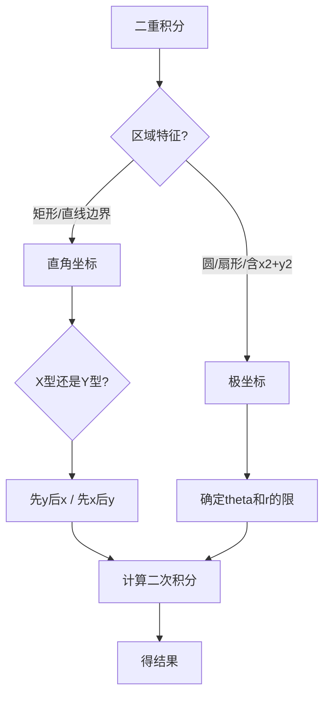

[ROUTE]: 高等数学/第六章 重积分与曲线积分/6.2 二重积分的计算.md

# 6.2 二重积分的计算

> **学科系统**：高等数学 → 重积分与曲线积分 → 二重积分的计算
> **秒杀类比**：二重积分计算就像"先扫地再拖地"——先沿一个方向扫（第一次积分），再沿垂直方向拖（第二次积分）。在直角坐标中是横平竖直地扫，在极坐标中是转圈扫。

## 一、 核心知识解构

### 1. 直角坐标系下的计算

#### $X$ 型区域（先 $y$ 后 $x$）
区域 $D: a \leq x \leq b,\; \varphi_1(x) \leq y \leq \varphi_2(x)$

$$\iint_D f(x,y) d\sigma = \int_a^b \left[ \int_{\varphi_1(x)}^{\varphi_2(x)} f(x,y) dy \right] dx$$

#### $Y$ 型区域（先 $x$ 后 $y$）
区域 $D: c \leq y \leq d,\; \psi_1(y) \leq x \leq \psi_2(y)$

$$\iint_D f(x,y) d\sigma = \int_c^d \left[ \int_{\psi_1(y)}^{\psi_2(y)} f(x,y) dx \right] dy$$

**口诀**："后积先定限，限内画条线，先交为下限，后交为上限。"

### 2. 极坐标系下的计算

#### 坐标变换
$$\begin{cases}
x = r\cos\theta \\
y = r\sin\theta
\end{cases}$$

#### 面积微元
$$d\sigma = r\, dr\, d\theta$$

#### 积分公式
$$\iint_D f(x,y) d\sigma = \iint_D f(r\cos\theta, r\sin\theta) \cdot r\, dr\, d\theta$$

#### 常见极坐标区域
| 区域类型 | 积分限 | 图示 |
|:---|:---|:---|
| 极点在区域外 | $\theta_1 \leq \theta \leq \theta_2,\; r_1(\theta) \leq r \leq r_2(\theta)$ | 扇形环 |
| 极点在边界上 | $\theta_1 \leq \theta \leq \theta_2,\; 0 \leq r \leq r(\theta)$ | 扇形 |
| 极点在区域内 | $0 \leq \theta \leq 2\pi,\; 0 \leq r \leq r(\theta)$ | 含原点的区域 |

### 3. 何时用极坐标

被积函数或积分区域含有 $x^2 + y^2$ 时优先考虑极坐标：

| 特征 | 例子 |
|:---|:---|
| 被积函数含 $x^2+y^2$ | $f(x,y) = \sqrt{x^2 + y^2}$，$f(x,y) = \frac{1}{x^2 + y^2}$ |
| 积分区域为圆/环/扇形 | $x^2 + y^2 \leq R^2$，$r_1 \leq r \leq r_2$ |
| 被积函数含 $\frac{y}{x}$ | $f(x,y) = \arctan\frac{y}{x}$ |

### 4. 交换积分次序

当原积分次序计算困难时，交换次序可能大大简化。

**步骤**：
1. 由原积分限画出积分区域 $D$
2. 将 $D$ 按另一种类型描述（$X$ 型 $\leftrightarrow$ $Y$ 型）
3. 写出新次序下的积分

### 5. 二重积分计算流程

## 二、 考试红牌警告与秒杀秘籍

* 🚨 **易错雷区**：极坐标下面积微元是 $r\,dr\,d\theta$——**不要漏掉 $r$**！这是最常见的错误
* 🚨 **易错雷区**：交换积分次序时，**上下限要对换**——先积分的变量上下限可能是后积分变量的函数
* 🚨 **易错雷区**：$X$ 型区域先对 $y$ 积分时，$y$ 的上下限是关于 $x$ 的函数（常数是特例）
* 🔑 **秒杀秘籍**：积分区域画图最重要——画对了图，积分限就定对了一半
* 🔑 **秒杀秘籍**：看到 $x^2 + y^2$ 立刻想到极坐标——$x^2 + y^2 = r^2$ 会大大简化被积函数
* 🔑 **秒杀秘籍**：如果先对一个变量积分积不出来，试试交换次序

## 三、 闭卷真题挑战

> **【真题演练】**：计算 $\iint_D (x + 2y) d\sigma$，其中 $D$ 由 $y = x^2$ 和 $y = x$ 围成。

> **点击查看答案与解析**
> **【正确答案】**：
> 交点：$x^2 = x \implies x(x-1) = 0 \implies x = 0$ 或 $x = 1$
>
> 按 $X$ 型：$0 \leq x \leq 1$，$x^2 \leq y \leq x$
>
> $$\iint_D (x + 2y) d\sigma = \int_0^1 \int_{x^2}^x (x + 2y) dy\, dx$$
>
> 先对 $y$ 积：
> $$\int_{x^2}^x (x + 2y) dy = [xy + y^2]_{x^2}^x = (x^2 + x^2) - (x^3 + x^4) = 2x^2 - x^3 - x^4$$
>
> 再对 $x$ 积：
> $$\int_0^1 (2x^2 - x^3 - x^4) dx = \left[\frac{2}{3}x^3 - \frac{1}{4}x^4 - \frac{1}{5}x^5\right]_0^1 = \frac{2}{3} - \frac{1}{4} - \frac{1}{5} = \frac{40 - 15 - 12}{60} = \frac{13}{60}$$
>
> **【核心解析】**：
> 二重积分计算标准流程：画区域 → 定类型 → 定限 → 先内层后外层。$X$ 型区域先对 $y$ 积分，$y$ 的下限是 $x^2$，上限是 $x$。

> **【真题演练】**：计算 $\iint_D e^{-(x^2 + y^2)} d\sigma$，其中 $D: x^2 + y^2 \leq 1$。

> **点击查看答案与解析**
> **【正确答案】**：
> 区域 $D$ 是单位圆，被积函数含 $x^2 + y^2$，用极坐标：
>
> $0 \leq \theta \leq 2\pi$，$0 \leq r \leq 1$，$x^2 + y^2 = r^2$
>
> $$\iint_D e^{-(x^2+y^2)} d\sigma = \int_0^{2\pi} \int_0^1 e^{-r^2} \cdot r\, dr\, d\theta$$
>
> $$\int_0^1 r e^{-r^2} dr = -\frac{1}{2}\int_0^1 e^{-r^2} d(-r^2) = -\frac{1}{2}[e^{-r^2}]_0^1 = -\frac{1}{2}(e^{-1} - 1) = \frac{1}{2}(1 - e^{-1})$$
>
> $$\int_0^{2\pi} d\theta = 2\pi$$
>
> 原积分 $= 2\pi \cdot \frac{1}{2}(1 - e^{-1}) = \pi(1 - \frac{1}{e})$
>
> **【核心解析】**：
> 经典的极坐标例题。$e^{-(x^2+y^2)}$ 在直角坐标下无法积分，但转化为极坐标后用凑微分法轻松解决。注意 $r e^{-r^2}$ 的积分用 $u = r^2$ 换元。

## 四、 📖 教材习题全解对照

> 本讲内容对应 **同济大学《高等数学》第八版 下册 第十章 重积分**

| 教材习题 | 对应知识点 | 难度 |
|:---|:---|:---:|
| **习题 10-2** 第1-6题 | 直角坐标二重积分 | ⭐⭐ |
| **习题 10-2** 第7-12题 | 交换积分次序 | ⭐⭐⭐ |
| **习题 10-3** 第1-6题 | 极坐标二重积分 | ⭐⭐ |
| **习题 10-3** 第7-12题 | 极坐标综合 | ⭐⭐⭐ |
| **总习题十** 第5-12题 | 二重积分计算综合 | ⭐⭐⭐ |

> 💡 **刷题建议**：二重积分是本章的核心内容，习题10-2和10-3的全部题目都值得练习。极坐标尤其重要——很多在直角坐标下算不了的题在极坐标下轻松解决。
