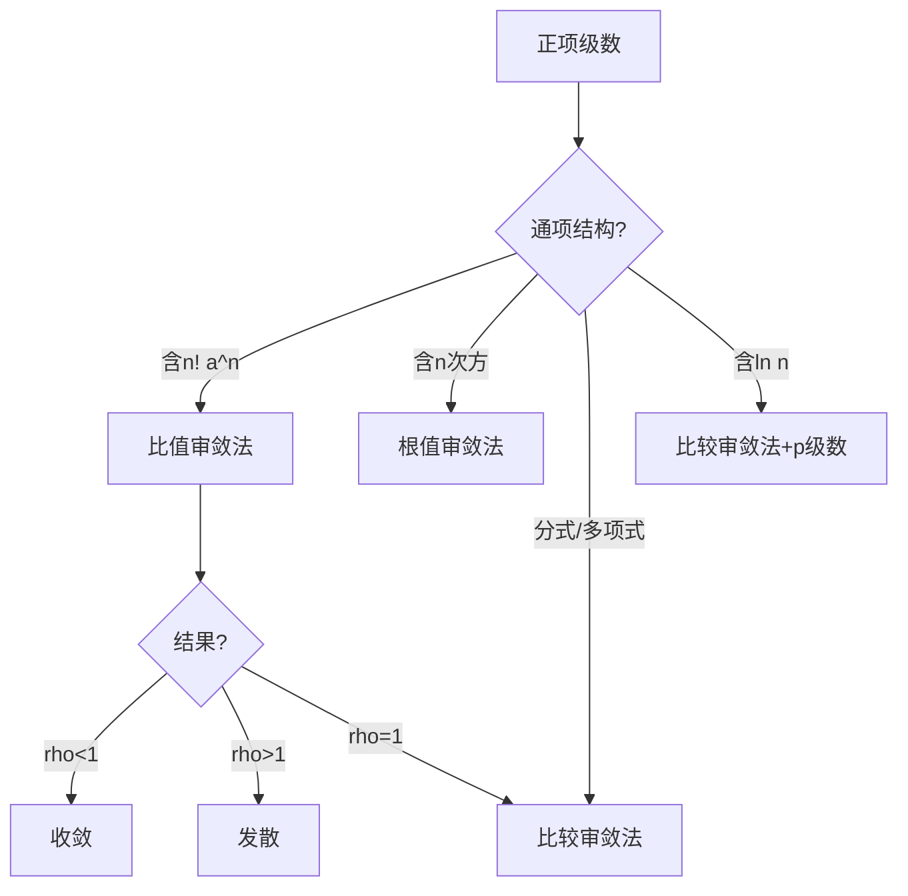

[ROUTE]: 高等数学/第八章 无穷级数/8.2 正项级数审敛法.md

# 8.2 正项级数审敛法

> **学科系统**：高等数学 → 无穷级数 → 正项级数审敛法
> **秒杀类比**：正项级数审敛法就像"体检"——比较法是把患者跟健康人比（已知敛散的标准级数），比值法看增长率（后项/前项的极限），根值法看衰减速度（开 $n$ 次方）。方法选对了，一眼就能看出健康不健康。

## 一、 核心知识解构

### 1. 正项级数的定义

若 $a_n \geq 0$（对所有 $n$），则 $\sum_{n=1}^\infty a_n$ 称为**正项级数**。

**性质**：正项级数的部分和数列单调递增，要么收敛（有上界），要么发散到 $+\infty$。

### 2. 比较审敛法（基本形式）

**定理**：设 $0 \leq a_n \leq b_n$，则：
- 若 $\sum b_n$ 收敛，则 $\sum a_n$ 收敛
- 若 $\sum a_n$ 发散，则 $\sum b_n$ 发散

**口诀**："大收则小收，小发则大发"。

### 3. 比较审敛法的极限形式

设 $\lim_{n\to\infty} \frac{a_n}{b_n} = l$（$0 < l < +\infty$），则 $\sum a_n$ 与 $\sum b_n$ 同敛散。

**常用比较对象**：
- $p$ 级数 $\sum \frac{1}{n^p}$（最常用）
- 等比级数 $\sum r^n$

### 4. 比值审敛法（达朗贝尔审敛法）

$$\lim_{n\to\infty} \frac{a_{n+1}}{a_n} = \rho$$

| $\rho$ 范围 | 结论 |
|:---:|:---|
| $\rho < 1$ | 收敛 |
| $\rho > 1$ | 发散 |
| $\rho = 1$ | 无法判定，换方法 |

**适用场景**：通项含 $n!$、$a^n$ 等因子。

### 5. 根值审敛法（柯西审敛法）

$$\lim_{n\to\infty} \sqrt[n]{a_n} = \rho$$

| $\rho$ 范围 | 结论 |
|:---:|:---|
| $\rho < 1$ | 收敛 |
| $\rho > 1$ | 发散 |
| $\rho = 1$ | 无法判定 |

**适用场景**：通项含 $n$ 次方，如 $a_n = (\frac{n}{n+1})^{n^2}$。

### 6. 审敛法选择指南

### 7. 常见比较对象表

| 比较对象 | 收敛条件 | 发散条件 |
|:---|:---:|:---:|
| $\sum \frac{1}{n^p}$ | $p > 1$ | $p \leq 1$ |
| $\sum \frac{1}{n\ln n}$ | — | 发散（积分判别法）|
| $\sum \frac{1}{n(\ln n)^p}$ | $p > 1$ | $p \leq 1$ |
| $\sum ar^n$ | $|r| < 1$ | $|r| \geq 1$ |

## 二、 考试红牌警告与秒杀秘籍

* 🚨 **易错雷区**：$\rho = 1$ 时比值/根值审敛法**无法判定**——需要用其他方法（如比较法）
* 🚨 **易错雷区**：比较法中，不等式方向不能搞反——"大收推小收，小发推大发"
* 🚨 **易错雷区**：比较法极限形式中 $l$ 要在 $(0, +\infty)$ 内——$l = 0$ 或 $l = +\infty$ 时需另作处理
* 🔑 **秒杀秘籍**：看到 $n!$ 立即用比值法——阶乘在比值中会大量约简
* 🔑 **秒杀秘籍**：看到多项式分式（如 $\frac{n^2+1}{n^4+3}$），用比较法，跟 $\frac{1}{n^2}$ 比
* 🔑 **秒杀秘籍**：看到 $\frac{1}{n^p}$ 形式直接 $p$ 级数判断——$p > 1$ 收敛，$p \leq 1$ 发散

## 三、 闭卷真题挑战

> **【真题演练】**：判断级数 $\sum_{n=1}^\infty \frac{n!}{n^n}$ 的敛散性。

> **点击查看答案与解析**
> **【正确答案】**：
> 用比值审敛法：
>
> $$\frac{a_{n+1}}{a_n} = \frac{(n+1)!}{(n+1)^{n+1}} \cdot \frac{n^n}{n!} = \frac{n+1}{(n+1)^{n+1}} \cdot n^n = \frac{n^n}{(n+1)^n} = \frac{1}{(1+\frac{1}{n})^n}$$
>
> $$\lim_{n\to\infty} \frac{a_{n+1}}{a_n} = \lim_{n\to\infty} \frac{1}{(1+\frac{1}{n})^n} = \frac{1}{e} < 1$$
>
> 由比值审敛法，级数**收敛**。
>
> **【核心解析】**：
> $n!$ 和 $n^n$ 同时在通项中，比值法最合适。注意化简时要仔细，极限 $\lim (1+\frac{1}{n})^n = e$ 是关键。

> **【真题演练】**：判断级数 $\sum_{n=1}^\infty \frac{1}{n^2 + 3n + 2}$ 的敛散性。

> **点击查看答案与解析**
> **【正确答案】**：
> 通项 $a_n = \frac{1}{n^2 + 3n + 2}$
>
> 与 $b_n = \frac{1}{n^2}$ 比较（$p=2 > 1$ 的 $p$ 级数，收敛）：
>
> $$\lim_{n\to\infty} \frac{a_n}{b_n} = \lim_{n\to\infty} \frac{n^2}{n^2 + 3n + 2} = 1 \in (0, +\infty)$$
>
> 由比较审敛法的极限形式，$\sum a_n$ 与 $\sum \frac{1}{n^2}$ 同敛散，故原级数**收敛**。
>
> **【核心解析】**：
> 多项式分式优先考虑比较法。分母最高次为 $n^2$，故用 $\frac{1}{n^2}$ 作比较。极限比值有限非零，说明同阶，敛散性相同。

## 四、 📖 教材习题全解对照

> 本讲内容对应 **同济大学《高等数学》第八版 下册 第十二章 无穷级数**

| 教材习题 | 对应知识点 | 难度 |
|:---|:---|:---:|
| **习题 12-2** 第1-6题 | 比较审敛法 | ⭐⭐ |
| **习题 12-2** 第7-12题 | 比值审敛法 | ⭐⭐ |
| **习题 12-2** 第13-18题 | 根值审敛法 | ⭐⭐⭐ |
| **总习题十二** 第5-10题 | 审敛法综合 | ⭐⭐⭐ |

> 💡 **刷题建议**：比值法和比较法是最常用的两种审敛法。习题12-2的1-12题覆盖了主要题型，建议全部练习。根值法了解即可。
