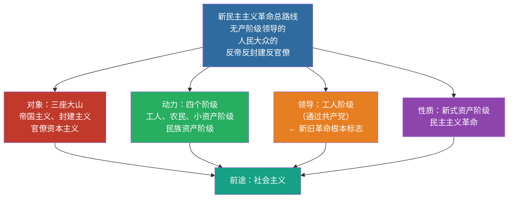

# 03 新民主主义革命理论

> 🎯 **一句话**：无产阶级领导的，人民大众的，反对帝国主义、封建主义和官僚资本主义的革命。

---

## 一、总路线（必背）

**无产阶级领导的，人民大众的，反对帝国主义、封建主义和官僚资本主义的革命。**

### 对象 / 动力 / 领导 / 性质 / 前途

| 要素 | 内容 |
|:---|:---|
| 对象 | 帝、封、官（三座大山） |
| 动力 | 工人阶级、农民阶级、城市小资产阶级、民族资产阶级 |
| 领导 | **工人阶级**（通过共产党）—— 区分新旧民主革命的根本标志 |
| 性质 | 资产阶级民主主义革命（新式） |
| 前途 | 社会主义 |

> 📌 记忆口诀：**对象三座山、动力四个级、领导无产党、性质新民主、前途是社会**。

---

## 二、三大法宝

1. **统一战线**
2. **武装斗争**
3. **党的建设**

---

## 三、道路与基本纲领

- **道路**：农村包围城市、武装夺取政权
- **政治纲领**：建立无产阶级领导的各革命阶级联合专政的民主共和国
- **经济纲领**：没收封建地主土地归农民；没收官僚资本归新民主主义国家；保护民族工商业
- **文化纲领**：民族的、科学的、大众的文化

---

## 四、闭卷挑战

**1.** 区分新旧民主主义革命的根本标志是什么？

> **点击查看答案与解析**
> 领导权是否掌握在无产阶级（共产党）手中。

**2.** 新民主主义革命的三大法宝是什么？

> **点击查看答案与解析**
> 统一战线、武装斗争、党的建设。

返回：02-毛泽东思想 · [政治](/posts/politics/)
