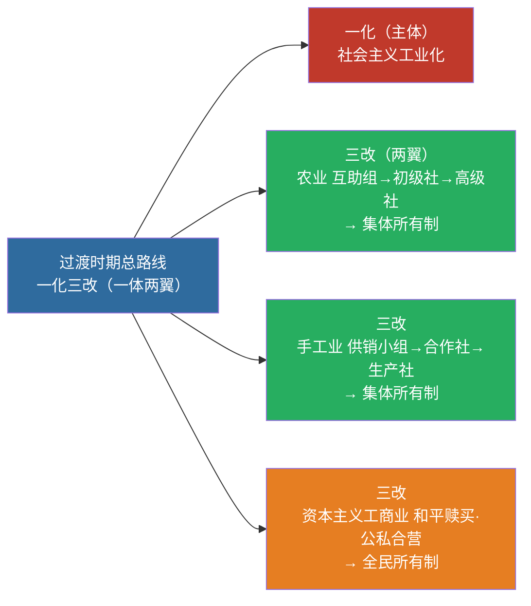

# 04 社会主义改造理论

> 🎯 **一句话**：过渡时期总路线 = **一化三改**（一体两翼）。

---

## 一、过渡时期总路线

**从中华人民共和国成立，到社会主义改造基本完成**，这是一个过渡时期。党在这个过渡时期的总路线和总任务是：

> 要在一个相当长的时期内，逐步实现国家的**社会主义工业化**，并逐步实现国家对**农业、手工业和资本主义工商业**的社会主义改造。

| 名称 | 内容 |
|:---|:---|
| 一化 | 社会主义工业化（主体） |
| 三改 | 农业、手工业、资本主义工商业的社会主义改造（两翼） |

> 📌 1956 年底改造基本完成 → 社会主义基本制度确立。记忆：**一化是主体，三改是两翼；农业走互助组，资本主义走和平赎买**。

---

## 二、改造道路要点

| 对象 | 道路/形式 | 结果 |
|:---|:---|:---|
| 农业 | 互助组 → 初级社 → 高级社 | 集体所有制 |
| 手工业 | 供销小组 → 供销合作社 → 生产合作社 | 集体所有制 |
| 资本主义工商业 | 和平赎买；加工订货、公私合营等 | 全民所有制 |

**1956 年底**：社会主义改造基本完成 → 社会主义基本制度在中国确立。

---

## 三、闭卷挑战

**1.** “一化三改”分别指什么？

> **点击查看答案与解析**
> 一化：社会主义工业化；三改：对农业、手工业、资本主义工商业的社会主义改造。

**2.** 社会主义基本制度在中国确立的标志性时间？

> **点击查看答案与解析**
> 1956 年底社会主义改造基本完成。

返回：03-新民主主义革命 · [政治](/posts/politics/)
