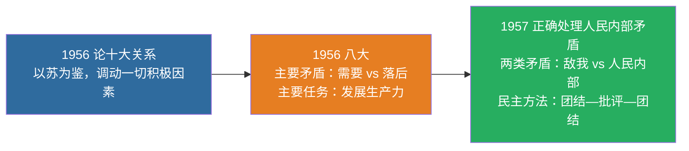

# 05 社会主义建设道路初步探索的理论成果

> 🎯 **一句话**：以苏为鉴，走自己的路；正确处理十大关系；正确处理人民内部矛盾。

---

## 一、重要文献与观点

| 文献/会议 | 核心观点 |
|:---|:---|
| 《论十大关系》（1956） | 调动一切积极因素为社会主义事业服务；以苏为鉴 |
| 党的八大（1956） | 主要矛盾：人民对于经济文化迅速发展的需要同当前经济文化不能满足人民需要的状况之间的矛盾；主要任务是发展生产力 |
| 《关于正确处理人民内部矛盾的问题》（1957） | 两类矛盾；人民内部矛盾用民主方法（团结—批评—团结） |

> 📌 记忆：**56 关系 + 56 八大 + 57 矛盾**——三年三件大事，构成社会主义建设初步探索的三大里程碑。

---

## 二、正反两方面

- **积极成果**：独立的比较完整的工业体系和国民经济体系；“两弹一星”等
- **曲折教训**：要科学判断国情与主要矛盾，坚持实事求是，按客观经济规律办事

---

## 三、闭卷挑战

**1.** 党的八大指出当时国内主要矛盾是什么？

> **点击查看答案与解析**
> 人民对于经济文化迅速发展的需要同当前经济文化不能满足人民需要的状况之间的矛盾。

**2.** 正确处理人民内部矛盾的基本方法是什么？

> **点击查看答案与解析**
> 民主的方法，即团结—批评—团结。

返回：04-社会主义改造 · [政治](/posts/politics/)
