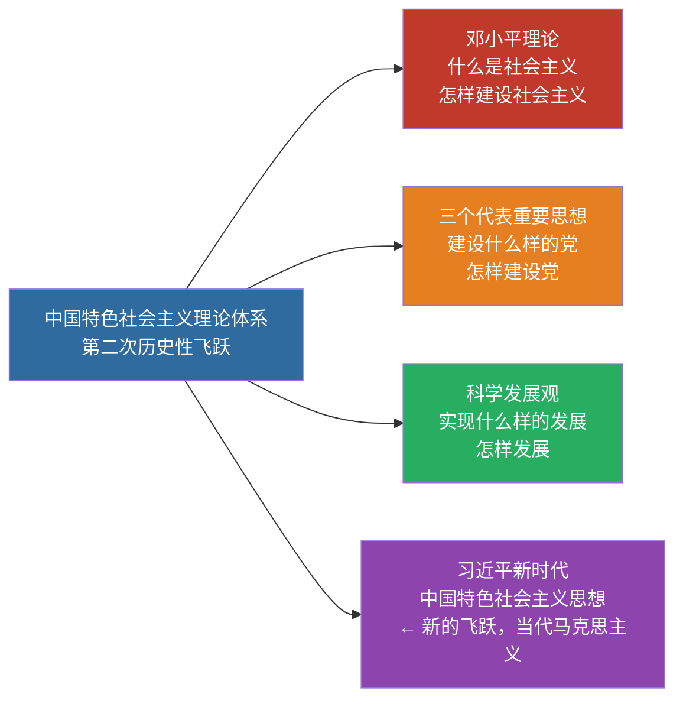

# 06 中国特色社会主义理论体系的形成发展

> 🎯 **一句话**：邓 + 三 + 科，是马克思主义中国化的**第二次历史性飞跃**（体系层面）。

---

## 一、体系构成

| 组成部分 | 主题/关键词 |
|:---|:---|
| 邓小平理论 | 什么是社会主义、怎样建设社会主义 |
| "三个代表"重要思想 | 建设什么样的党、怎样建设党 |
| 科学发展观 | 实现什么样的发展、怎样发展 |

> 📌 记忆：**邓三科 + 习 = 中国特色社会主义理论体系的主力军**。邓答"社"、三答"党"、科答"发展"、习答"新时代"。

> 习近平新时代中国特色社会主义思想是马克思主义中国化时代化新的飞跃，是当代中国马克思主义、二十一世纪马克思主义（与上述体系既一脉相承又与时俱进）。

---

## 二、形成条件（简记）

- 时代主题：和平与发展
- 实践基础：改革开放和社会主义现代化建设
- 历史经验：国内外社会主义建设正反经验
- 思想渊源：马列主义、毛泽东思想

---

## 三、闭卷挑战

**1.** 中国特色社会主义理论体系主要包括哪些内容？

> **点击查看答案与解析**
> 邓小平理论、“三个代表”重要思想、科学发展观。

返回：05-建设道路初步探索 · [政治](/posts/politics/)
