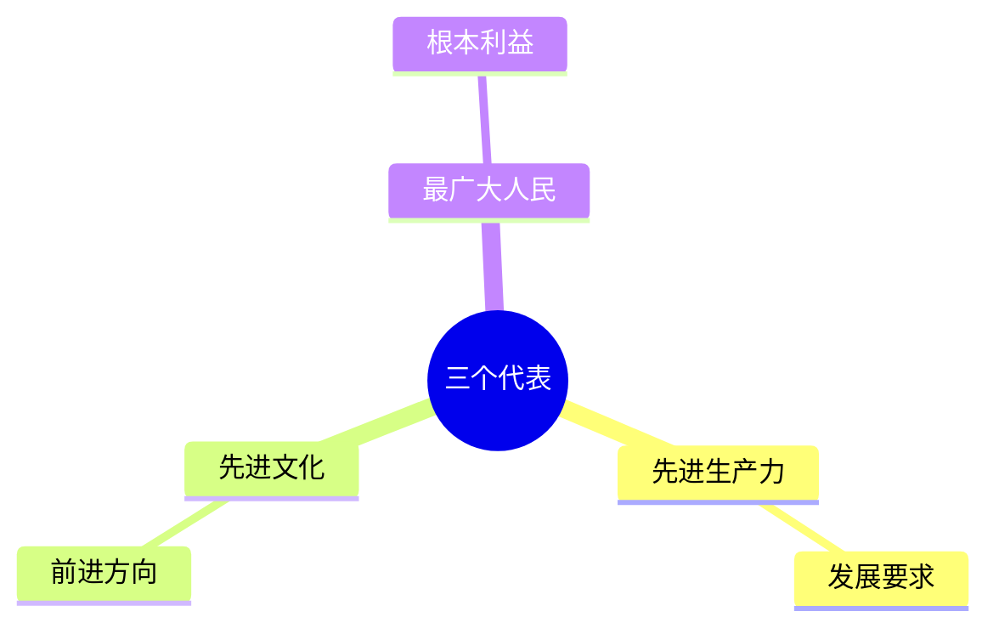
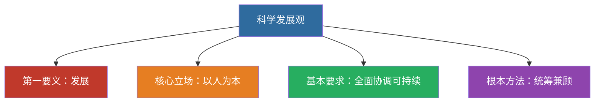

# 08 “三个代表”重要思想与科学发展观

---

## 一、“三个代表”重要思想

中国共产党必须始终：

1. 代表中国**先进生产力**的发展要求
2. 代表中国**先进文化**的前进方向
3. 代表中国**最广大人民**的根本利益

**本质**：立党为公、执政为民。

> 📌 本质：**立党为公、执政为民**。

---

## 二、科学发展观

- **第一要义**：发展
- **核心立场**：以人为本
- **基本要求**：全面协调可持续
- **根本方法**：统筹兼顾

> 📌 记忆：**发展（要义）→ 人本（立场）→ 全面协调可持续（要求）→ 统筹兼顾（方法）**。

**历史地位**：马克思主义关于发展的世界观和方法论的集中体现；党的十七大写入党章，十八大列为指导思想。

---

## 三、闭卷挑战

**1.** 默写“三个代表”完整表述。

> **点击查看答案与解析**
> 始终代表中国先进生产力的发展要求、中国先进文化的前进方向、中国最广大人民的根本利益。

**2.** 科学发展观的第一要义、核心立场、基本要求、根本方法？

> **点击查看答案与解析**
> 发展；以人为本；全面协调可持续；统筹兼顾。

返回：07-邓小平理论 · [政治](/posts/politics/)
