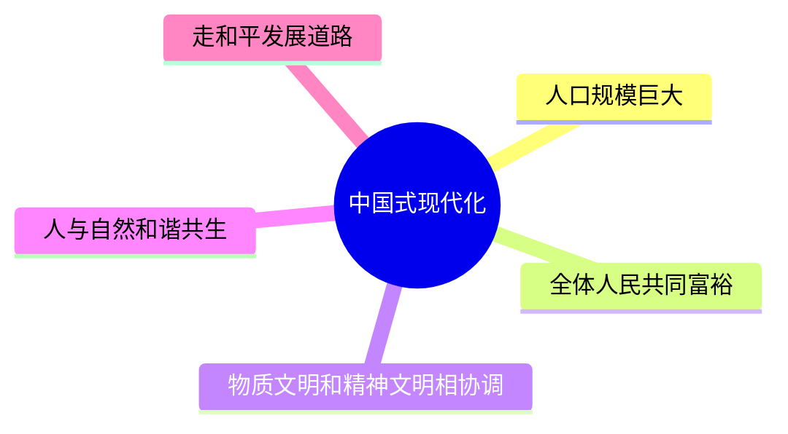
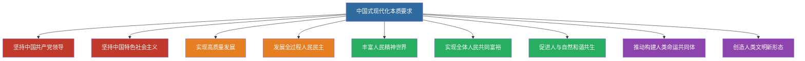

# 10 中国式现代化与中华民族伟大复兴

> 🎯 **一句话**：以中国式现代化全面推进中华民族伟大复兴。

---

## 一、中国式现代化的中国特色（5 条必背）

1. 人口规模巨大的现代化
2. 全体人民共同富裕的现代化
3. 物质文明和精神文明相协调的现代化
4. 人与自然和谐共生的现代化
5. 走和平发展道路的现代化

> 📌 记忆口诀：**人、富、物精、人自、和平**——"一个最大（人口），两个协调（物质精神、人与自然），两个全体/共同（共同富裕、和平发展）"。

## 二、本质要求（简记框架）

坚持中国共产党领导，坚持中国特色社会主义，实现高质量发展，发展全过程人民民主，丰富人民精神世界，实现全体人民共同富裕，促进人与自然和谐共生，推动构建人类命运共同体，创造人类文明新形态。

> 📌 记忆分层：**两个坚持（党+社会主义）→ 四个实现（高质量、全过程民主、人民精神、共同富裕）→ 三个促进（人与自然、人类命运共同体、人类文明新形态）**。

## 三、中心任务

团结带领全国各族人民全面建成社会主义现代化强国、实现第二个百年奋斗目标，以中国式现代化全面推进中华民族伟大复兴。

---

## 四、闭卷挑战

**1.** 默写中国式现代化的五个中国特色。

> **点击查看答案与解析**
> 人口规模巨大；全体人民共同富裕；物质文明和精神文明相协调；人与自然和谐共生；走和平发展道路。

返回：09-习思想形成与历史地位 · [政治](/posts/politics/)
