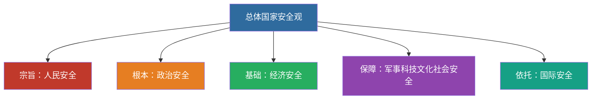

# 14 生态文明 · 国家安全 · 国防军队 · 祖国统一 · 大国外交

---

## 一、建设社会主义生态文明

- **绿水青山就是金山银山**
- 人与自然和谐共生
- 碳达峰碳中和（双碳）目标

---

## 二、维护和塑造国家安全

- **总体国家安全观**
- 以人民安全为宗旨，以政治安全为根本，以经济安全为基础，以军事、科技、文化、社会安全为保障，以促进国际安全为依托

> 📌 记忆链：**宗旨人民 → 根本政治 → 基础经济 → 保障四个 → 依托国际**。

---

## 三、建设巩固国防和强大人民军队

- 党对人民军队的绝对领导是人民军队的建军之本、强军之魂
- 新时代强军目标：听党指挥、能打胜仗、作风优良

---

## 四、坚持“一国两制”和推进祖国完全统一

- “一国两制”是中国特色社会主义的伟大创举
- “一国”是实行“两制”的前提和基础
- 解决台湾问题、实现祖国完全统一，是党矢志不渝的历史任务
- 坚持一个中国原则和“九二共识”

---

## 五、中国特色大国外交

- 推动构建**人类命运共同体**
- 共商共建共享的全球治理观
- “一带一路”倡议
- 独立自主的和平外交政策

---

## 六、闭卷挑战

**1.** 总体国家安全观“以何为宗旨、以何为根本、以何为基础”？

> **点击查看答案与解析**
> 以人民安全为宗旨，以政治安全为根本，以经济安全为基础。

**2.** 新时代的强军目标是什么？

> **点击查看答案与解析**
> 听党指挥、能打胜仗、作风优良。

返回：13-民主法治文化民生 · [政治](/posts/politics/)
