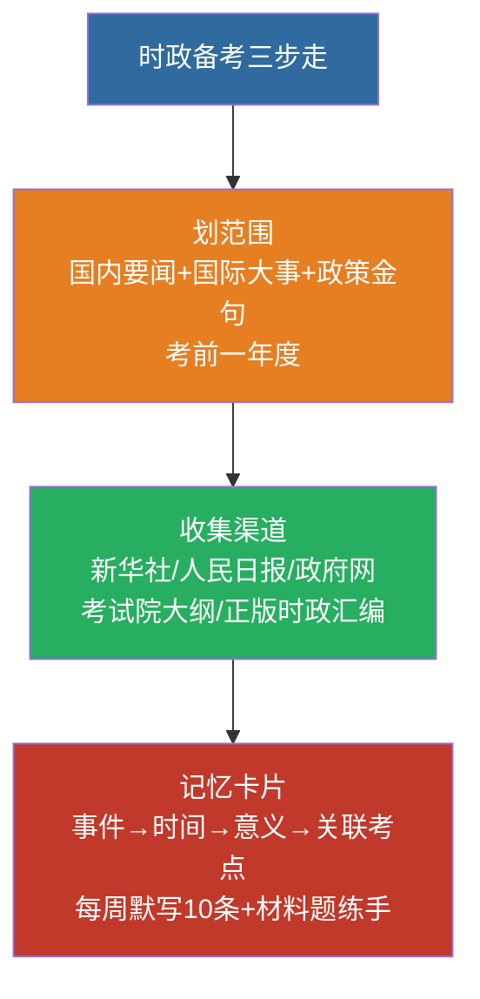

# 16 时事政治备考指南

> 🎯 **一句话**：考纲写明考查**考前一年度**国内外重大时事与重大路线方针政策。

---

## 一、范围怎么划

| 类型 | 抓什么 |
|:---|:---|
| 国内 | 重要会议（中央全会、全国两会）、重大规划、周年纪念 |
| 国际 | 中国重大外交倡议、全球治理热点中的中国方案 |
| 政策金句 | 官方权威表述，勿用自媒体改写版 |



**2026 考纲示例表述**：时事政治（2025 年 1 月 1 日至 2025 年 12 月 31 日……）—— 每年日期区间以**当年大纲**为准。

---

## 二、高效收集渠道（合法公开）

1. 新华社 / 人民日报 权威稿
2. 中国政府网 政策发布
3. 省考试院当年简章与大纲
4. 正版时政月刊 / 考前汇编（注意版本年份）

---

## 三、记忆卡片模板

```
事件/会议：
时间：
一句话意义：
可能出题角度（选择/材料）：
关联教材章节：
```

---

## 四、闭卷自测

每周默写 10 条本周时政金句；材料题练“原理挂钩”。

返回：15-全面从严治党 · [政治](/posts/politics/)

---

## 五、确定性考点骨架（2027 届 · 可先背的部分）

> ⚠️ **诚实声明**：以下只列**制度性日程与周年规律**这类可提前确定的骨架，不含具体会议结论（未发生/未核实的不编）。具体事件**发生后按下方月度台账登记**。你的考试区间 = **2026.1.1–12.31**（2027 年 3 月考试对应考前一整年）。

### 1. 2026 全年制度性日程（确定会发生，答案以官方公报为准）

| 时间 | 事项 | 备考关注点 |
|:---|:---|:---|
| 3 月上旬 | **全国两会**（十四届全国人大四次会议 + 全国政协十四届四次会议） | 政府工作报告要点：GDP 目标、民生数字、新提法 |
| 3 月 | 地方两会季 | 广东省省政府工作报告（区域考点） |
| 下半年 | **党的二十届四中全会**（按惯例下半年召开，议题以会前政治局会议公报为准） | 全会公报新表述 = 高频选择题源 |
| 10 月 1 日 | 国庆 77 周年 | 一般不出大题，留意讲话金句 |
| 12 月 | 中央经济工作会议 | 定调次年经济工作，其 2026 提法会延续到 2027 备考 |

> 注：会议名称按惯例推算，**正式名称与议题以官方发布为准**，背会前别写死。

### 2. 2026 年确定性周年纪念（整数周年最常考）

| 年份 | 事件 | 周年 |
|:---:|:---|:---:|
| 1926 | 北伐战争开始 | **100 周年** ⭐ |
| 1936 | 红军长征胜利结束 | **90 周年** |
| 1936 | 西安事变 | **90 周年** |
| 1956 | 三大改造基本完成 / 社会主义制度确立 | **70 周年** |
| 1986 | 「863 计划」启动 | 40 周年 |
| 2016 | 建党 95 周年讲话 / 长征胜利 80 周年讲话 | 10 周年 |

> 背法：**「北伐 100、长征 90、三大改造 70」**三个最稳，周年纪念题是时政里唯一「不用等新闻」的题型。

### 3. 月度台账（发生了就登记，别攒到 12 月）

```
事件/会议：
时间：
一句话意义：
可能出题角度（选择/材料）：
关联教材章节：→ 01-马克思主义中国化时代化 ~ 15-全面从严治党 对应
```

| 月份 | 已确认重大事件（登记处） |
|:---:|:---|
| 2026.01 | （待登记） |
| 2026.02 | （待登记） |
| 2026.03 | （待登记） |
