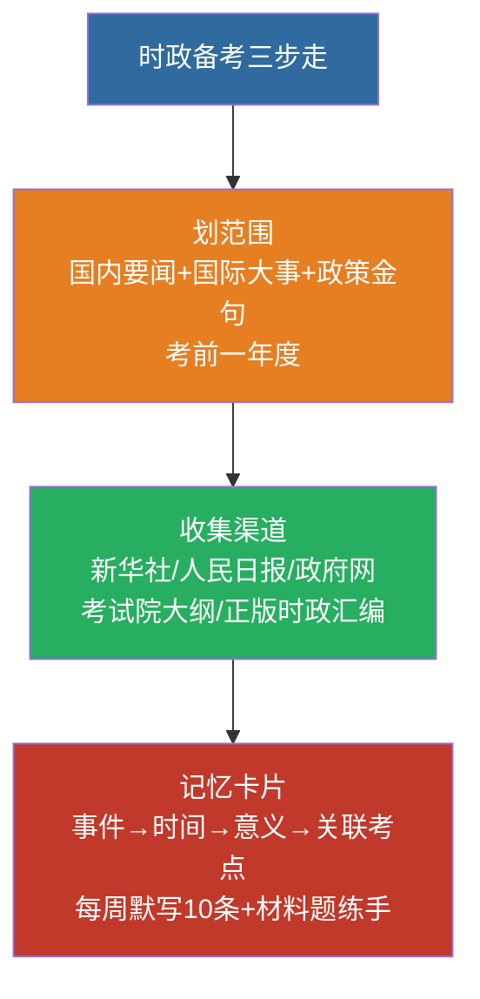

# 16 时事政治备考指南

> 🎯 **一句话**：考纲写明考查**考前一年度**国内外重大时事与重大路线方针政策。

---

## 一、范围怎么划

| 类型 | 抓什么 |
|:---|:---|
| 国内 | 重要会议（中央全会、全国两会）、重大规划、周年纪念 |
| 国际 | 中国重大外交倡议、全球治理热点中的中国方案 |
| 政策金句 | 官方权威表述，勿用自媒体改写版 |



**2026 考纲示例表述**：时事政治（2025 年 1 月 1 日至 2025 年 12 月 31 日……）—— 每年日期区间以**当年大纲**为准。

---

## 二、高效收集渠道（合法公开）

1. 新华社 / 人民日报 权威稿
2. 中国政府网 政策发布
3. 省考试院当年简章与大纲
4. 正版时政月刊 / 考前汇编（注意版本年份）

---

## 三、记忆卡片模板

```
事件/会议：
时间：
一句话意义：
可能出题角度（选择/材料）：
关联教材章节：
```

---

## 四、闭卷自测

每周默写 10 条本周时政金句；材料题练“原理挂钩”。

返回：15-全面从严治党 · [政治](/posts/politics/)
