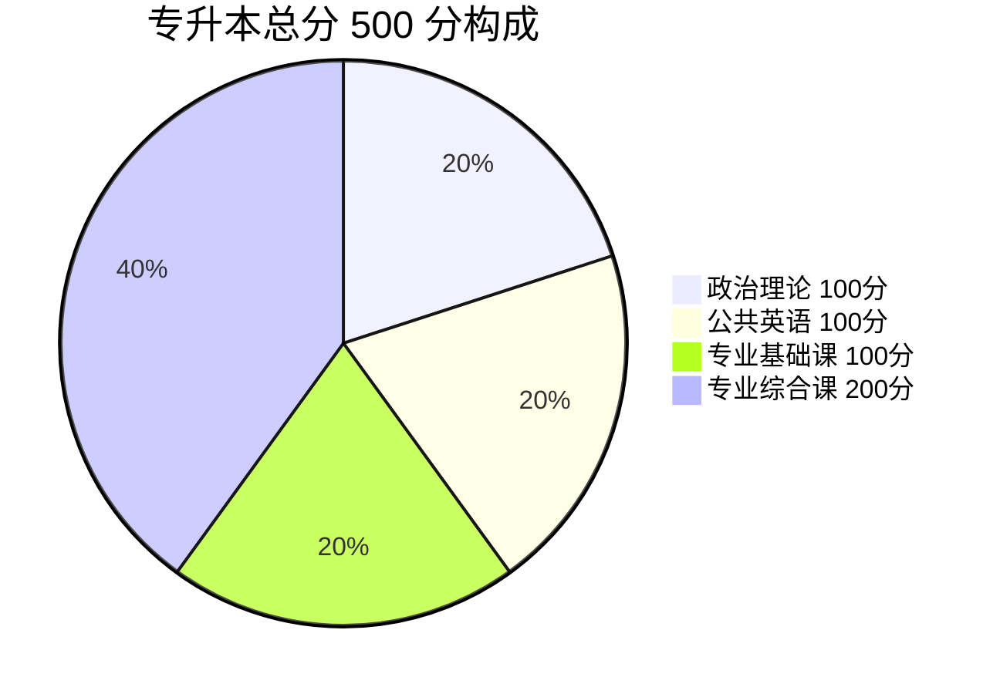

# 广东专升本考试概况与科目结构

> **外部调研版** · 取数时间：2026-08-23
> **官方依据**：[广东省教育考试院《广东省2026年普通高等学校专升本招生工作规定》（粤招办普〔2025〕51号，2025-11-19 发布）](https://eea.gd.gov.cn/bmbk_sksywj/content/post_4802375.html)

---

## 一、考试全称与性质

- **全称**：广东省普通高等学校专升本招生考试（俗称「**专插本**」）
- **主办**：广东省教育考试院
- **性质**：全日制普通专升本，被录取后插入本科大三就读，毕业后获全日制本科学历+学位

---

## 二、科目结构（4 门）

| 序号 | 科目类型 | 科目 | 满分 | 时长 | 说明 |
|:---:|:---|:---|:---:|:---:|:---|
| 1 | 公共课 | **政治理论** | 100 分 | 120 分钟 | 必考 |
| 2 | 公共课 | **公共英语** | 100 分 | 120 分钟 | 必考 |
| 3 | 专业基础课 | 按专业门类（高等数学 / 大学语文 / 管理学 / 经济学 / 计算机等） | 100 分 | 120 分钟 | 与报考专业对应 |
| 4 | 专业综合课 | 按专业门类 | 200 分 | 150 分钟 | 部分专业省统考，部分院校自命题 |

> 总分 500 分。专业基础课与专业综合课的具体科目，取决于报考院校与专业，见当年《广东省普通高等学校专升本招生专业目录及考试要求》。

> 📌 **专业综合课 200 分占 40%**——单科权重最大，是拉开差距的关键。

---

## 三、考纲载体（重要）

- 统考科目考试要求由**省教育考试院编写**，汇编于《**广东省普通高等学校专升本招生专业目录及考试要求**》一书
- **每年 1 月发布**，纸质发行 + 报名系统可查
- 该书含：统考科目考试大纲全文、参考教材、招生专业目录
- ⚠️ 官方考纲全文**不在官网免费公开**，第三方（新东方、库课等）有转述解读

---

## 四、考试时间节点（以 2026 年为例）

| 事项 | 时间 |
|:---|:---|
| 招生工作规定发布 | 前一年 11 月 |
| 报名 | 次年 1 月左右 |
| 考试 | 次年 3 月（2026 年政治理论为 3 月 28 日 09:00—11:00） |
| 成绩公布 | 4—5 月 |
| 志愿填报 | 5 月（2026 年为 5 月 13—17 日） |
| 录取 | 6 月 |

---

## 五、各科题型一览

### 政治理论（100 分 / 120 分钟）

| 题型 | 分值占比 |
|:---|:---|
| 单选题 | 客观题约 30+ 分 |
| 多选题 | ↑ |
| 辨析题 | 主观题（理解） |
| 简答题 | 主观题（理解） |
| 论述题 | 主观题（应用+时政） |
| 材料分析题 | 主观题（应用+时政） |

### 公共英语（100 分 / 120 分钟，2023 年改革后现行结构）

| 题型 | 题量 × 分值 | 小计 |
|:---|:---:|:---:|
| 阅读理解 | 15 题 × 2 分 | 30 分 |
| 短文造句匹配（五选五） | 5 题 × 2 分 | 10 分 |
| 完形填空 | 15 题 × 2 分 | 30 分 |
| 语法填空 | 10 题 × 1.5 分 | 15 分 |
| 写作（约 100 词应用文） | 1 题 | 15 分 |

> 2023 年改革：取消 30 道词汇语法单选，新增短文匹配与语法填空，阅读由 4 篇减为 3 篇，完形分值大增。2024/2025/2026 连续三年考纲一致。

### 高等数学（100 分 / 120 分钟）

| 题型 | 题量 | 每题分值 | 小计 |
|:---|:---:|:---:|:---:|
| 单项选择题 | 5 题 | 3 分 | 15 分 |
| 填空题 | 5 题 | 3 分 | 15 分 |
| 计算题 | 8 题 | 6 分 | 48 分 |
| 综合题 | 2 题 | 10+12 分 | 22 分 |
| **合计** | **20 小题** | | **100 分** |

> 题型题量在 2024—2026 年真题中保持一致。

---

## 六、官方渠道

- 广东省教育考试院官网：https://eea.gd.gov.cn
- 招生工作规定：https://eea.gd.gov.cn/bmbk_sksywj/content/post_4802375.html
- 政策解读（志愿填报等）：https://eea.gd.gov.cn/zcjd/

---

## 本库配套

- 政治真题与笔记 → [/posts/politics](/posts/politics/)
- 英语真题与刷题版 → [/posts/english](/posts/english/)
- 数学真题与章节笔记 → [/posts/math](/posts/math/)
- [官方教材与参考书清单](/posts/resources/官方教材与参考书清单)
- [零基础学习路线图](/posts/resources/零基础学习路线图)
- [科学学习方法](/posts/resources/科学学习方法)
