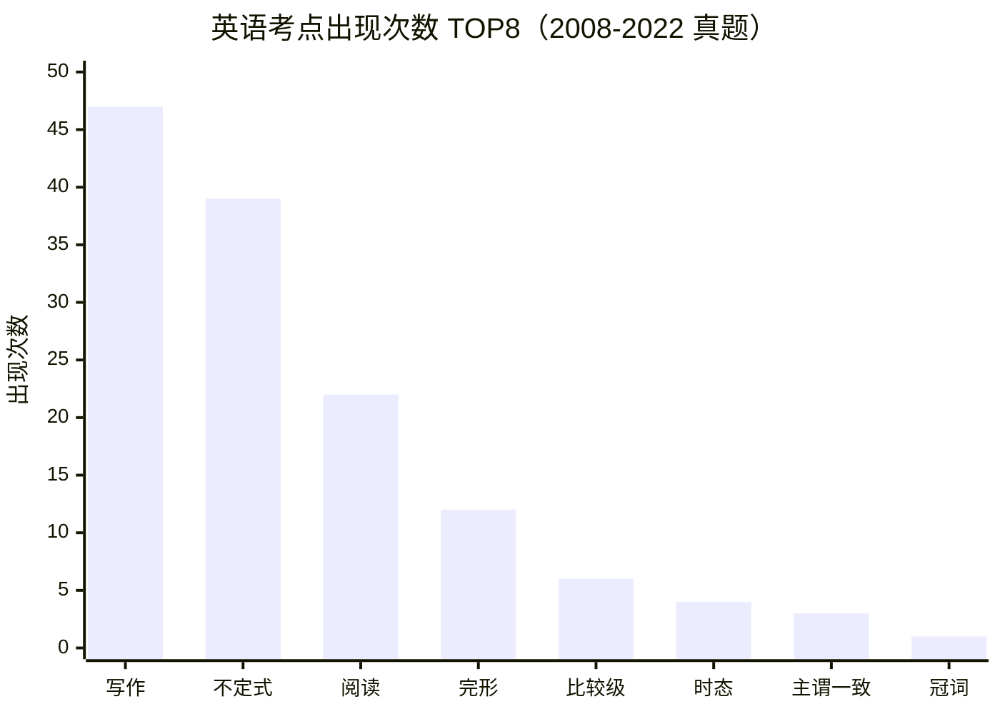

# 公共英语

> 统计源：英语 2008-2022 真题集（文字层提取）

| 排名 | 考点 | 出现次数 |
|:---:|:---|:---:|
| 1 | 写作 | 47 |
| 2 | 不定式 | 39 |
| 3 | 阅读理解 | 22 |
| 4 | 完形填空 | 12 |
| 5 | 比较级 | 6 |
| 6 | 时态 | 4 |
| 7 | 主谓一致 | 3 |
| 8 | 冠词 | 1 |
| 9 | 被动语态 | 0 |
| 10 | 虚拟语气 | 0 |
| 11 | 非谓语动词 | 0 |
| 12 | 动名词 | 0 |
| 13 | 分词 | 0 |
| 14 | 定语从句 | 0 |
| 15 | 名词性从句 | 0 |
| 16 | 状语从句 | 0 |
| 17 | 倒装 | 0 |
| 18 | 介词 | 0 |
| 19 | 固定搭配 | 0 |
| 20 | 情态动词 | 0 |

> 📌 **结论**：写作（47）+ 不定式（39）+ 阅读（22）+ 完形（12）= **120 次，占 TOP8 总量 87%**——复习重心应压在这四项上。