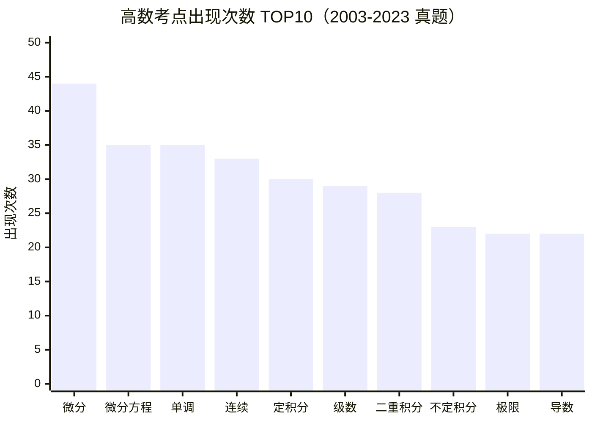

# 高等数学

> 统计源：高数 2003-2023 历年试卷合集（文字层提取）

| 排名 | 考点 | 出现次数 |
|:---:|:---|:---:|
| 1 | 微分 | 44 |
| 2 | 微分方程 | 35 |
| 3 | 单调 | 35 |
| 4 | 连续 | 33 |
| 5 | 定积分 | 30 |
| 6 | 级数 | 29 |
| 7 | 二重积分 | 28 |
| 8 | 不定积分 | 23 |
| 9 | 极限 | 22 |
| 10 | 导数 | 22 |
| 11 | 体积 | 15 |
| 12 | 多元函数 | 13 |
| 13 | 面积 | 13 |
| 14 | 渐近线 | 11 |
| 15 | 极值 | 9 |
| 16 | 无穷小 | 9 |
| 17 | 隐函数 | 9 |
| 18 | 间断 | 7 |
| 19 | 凹凸 | 6 |
| 20 | 参数方程 | 5 |

> 📌 **微分（44）** 和 **微分方程（35）** 是绝对王者——微分+定积分+不定积分=97 次，占 TOP10 约 33%。